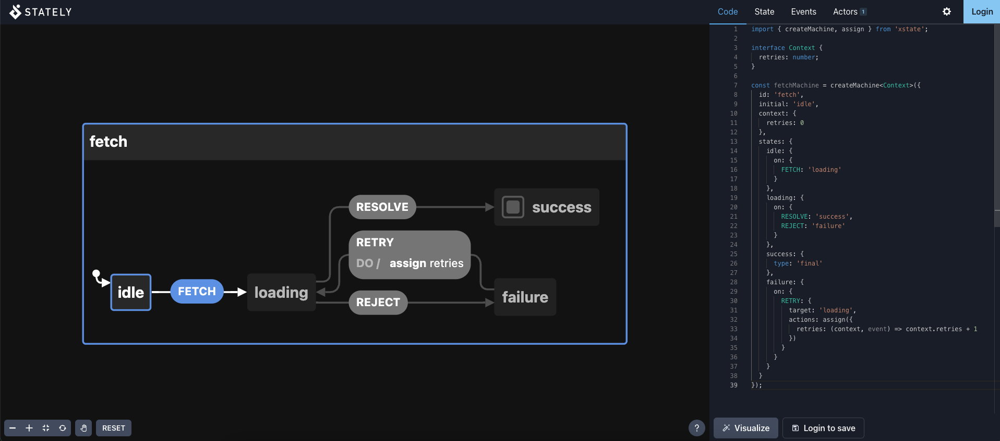

  <a href="https://xstate.js.org">
   
  
   
    <strong>Handle complexity anywhere JavaScript runs</strong>
   
   
  </a>

Handle complexity anywhere JavaScript runs using statecharts.

- Create **robust applications**, both on the **frontend and backend**
- **Visualise your app's logic** in our awesome **dev tools**
- Integrates with Node, [React](./packages/xstate-react/index.md), [Vue](./packages/xstate-vue/index.md), [Svelte](./packages/xstate-svelte/index.md) - anywhere JavaScript runs

New to state machines and statecharts? [Read our introduction](/guides/introduction-to-state-machines-and-statecharts/).

💬 Chat on the [Stately Discord Community](https://discord.gg/KCtSX7Cdjh)

## Packages

- 🤖 `xstate` - Core finite state machine and statecharts library + interpreter
- [🔬 `@xstate/fsm`](https://github.com/statelyai/xstate/tree/main/packages/xstate-fsm) - Minimal finite state machine library
- [📉 `@xstate/graph`](https://github.com/statelyai/xstate/tree/main/packages/xstate-graph) - Graph traversal utilities for XState
- [⚛️ `@xstate/react`](https://github.com/statelyai/xstate/tree/main/packages/xstate-react) - React hooks and utilities for using XState in React applications
- [💚 `@xstate/vue`](https://github.com/statelyai/xstate/tree/main/packages/xstate-vue) - Vue composition functions and utilities for using XState in Vue applications
- [🎷 `@xstate/svelte`](https://github.com/statelyai/xstate/tree/main/packages/xstate-svelte) - Svelte utilities for using XState in Svelte applications
- [✅ `@xstate/test`](https://github.com/statelyai/xstate/tree/main/packages/xstate-test) - Model-Based-Testing utilities (using XState) for testing any software
- [🔍 `@xstate/inspect`](https://github.com/statelyai/xstate/tree/main/packages/xstate-inspect) - Inspection utilities for XState

## Templates

Get started by forking one of these templates on CodeSandbox:

- [XState Template](https://codesandbox.io/s/xstate-example-template-m4ckv) - no framework
- [XState + TypeScript Template](https://codesandbox.io/s/xstate-typescript-template-s9kz8) - no framework
- [XState + React Template](https://codesandbox.io/s/xstate-react-template-3t2tg)
- [XState + React + TypeScript Template](https://codesandbox.io/s/xstate-react-typescript-template-wjdvn)
- [XState + Vue Template](https://codesandbox.io/s/xstate-vue-template-composition-api-1n23l)
- [XState + Vue 3 Template](https://codesandbox.io/s/xstate-vue-3-template-vrkk9)
- [XState + Svelte Template](https://codesandbox.io/s/xstate-svelte-template-jflv1)

## Dev Tools

### Visualizer

Visualize, simulate, and share your statecharts in the **[Stately Visualizer](./visualizer/index.md)**

### VSCode Extension

Get autocomplete, linting, refactors and visualization in your IDE with our [VSCode extension](https://marketplace.visualstudio.com/items?itemName=mattpocock.xstate-vscode)

## Sponsors

Huge thanks to the following companies for sponsoring `xstate`. You can sponsor further `xstate` development [on OpenCollective](https://opencollective.com/xstate).

