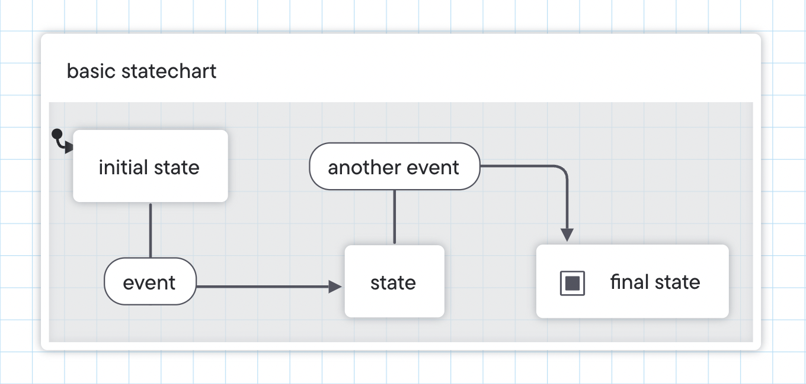
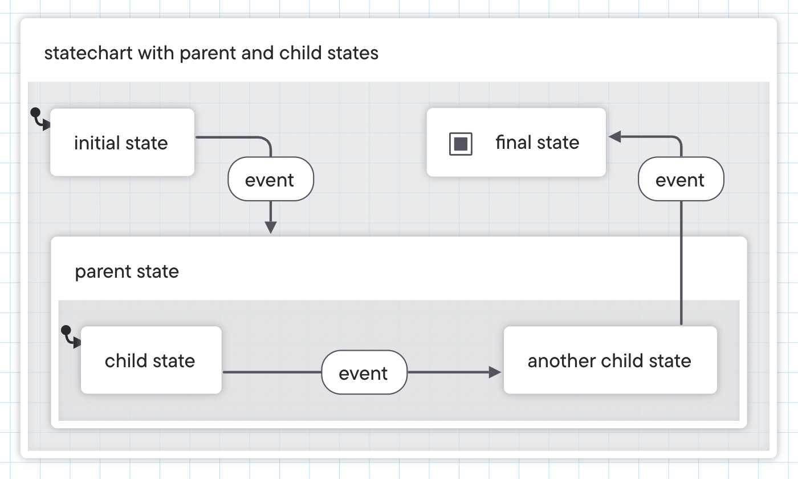

# Glossary

This glossary is a guide to the most common terms in statecharts and state machines.

:::tip Check out our new docs!
🆕 Find more terms in our [all-new Stately and XState glossary](https://stately.ai/docs/glossary).
:::

## State machines

A state machine is a model that describes how the state of a process transitions to another state when an event occurs.

State machines make building reliable software easier because they prevent impossible states and undesired transitions.

## Statecharts

Statecharts are a visual extension to state machines enabling you to model more complex logic, including hierarchy, concurrency, and communication.

You may have used similar diagrams in the past to design user flows, plan data transformations or map app logic. Statecharts are another way of using boxes and arrows to represent these kinds of flows. These flows are also executable code you can use to control the logic directly in your application code.

## States

A state describes the status of the machine. This status defines how the machine behaves when it receives an event. A state can be as simple as _active_ or _inactive_. These states are finite; the machine can only move through the predefined states. Machines can only be in one state at a time. [Parent states](#parent-and-child-states) and [parallel state](#parallel-states) can be used to express an overall state that is the combination of child states.

### Initial state

When a state machine starts, it enters the **initial state** first. The  icon represents the initial state. A machine can only have one top-level initial state.

<!-- What a state might be -->

#### Initial states in child states

Inside a parent state, you must specify which child state is the initial state, which the machine enters automatically when it enters the parent state. The  icon represents the initial state.

<!-- What is a typical initial state -->

### Parent and child states

States can contain more states, also known as child states. These child states can only happen when the parent state is happening.

<!-- Why you might use parent and child states -->

### Final state

When a machine reaches the final state, it can no longer receive any events, and anything running inside it is canceled and cleaned up. The  icon represents the final state.

A machine can have multiple final states or no final states.

<!-- What makes a typical final state, and when might you have no final states or multiple final states -->

### Parallel states

A parallel state is a parent state separated into multiple regions of child states, where each region is active simultaneously. Regions are represented by a dashed line around each region.

<!-- Why you might use parallel states -->

### History state

A history state returns the machine to the most recently active state. The  icon represents the history state.

The history state can be deep or shallow:

- A shallow history state remembers the immediate child’s state.
- A deep history state remembers the deepest active state or states inside its child states.

The  icon represents the deep history state.

<!-- What you might use a shallow history state for -->

<!-- What you might use a deep history state for -->

## Transitions and events

A machine moves from state to state through transitions. These transitions are caused by events. Events are deterministic; each combination of state and event always points to the same next state.

<!-- What is a typical event -->

### Guarded transitions

A guard is a condition that the machine checks when it goes through an event. If the condition is true, the machine follows the transition to the next state. If the condition is false, the machine follows the rest of the conditions to the next state. Any transition can be a guarded transition.

<!-- What you might use a guard for -->

### Eventless transitions

Eventless transitions are transitions without events. These transitions are **always** taken after any transition in their state if enabled; no event is necessary to trigger the transition. Eventless transitions are labeled “always” and often referred to as “always” transitions.

<!-- What you might use an eventless transition for -->

### Wildcard transitions

Wildcard transitions are triggered by any event not already handled by the current state. Wildcard transitions are represented by an asterisk \*.

Wildcard transitions are useful for logging untracked events and reducing code duplication.

<!-- What you might use a wildcard transition for -->

<!-- #### Partial wildcard transitions -->

<!-- Will be in v5 -->

<!-- ### Raised events -->

<!-- Will be in v5 -->

## Actors, actions and invoked actors

A statechart is an executable model of an actor. When you run a statechart, it becomes an actor; a running process that can receive messages, send messages and change its behavior based on the messages it receives, which can cause effects outside of the actor.

While the statechart actor is running, it can run other processes called actions.

An action can be fired upon entry or exit of a state and can also be fired on transitions. Entry and exit actions are fire-and-forget processes; once the machine has fired the action, it moves on and forgets the action.

<!-- What you might use an action (on a state) for -->

<!-- What you might use an action transition for -->

An invoked actor is an actor that can execute its own actions and communicate with the machine. These invoked actors are started in a state and stopped when the state is exited.
