# Introduction to state machines and statecharts

Statecharts are a visual language used to describe the states in a process.

You may have used similar diagrams in the past to design user flows, plan databases or map app architecture. Statecharts are another way of using boxes and arrows to represent flows, but with XState these flows are also executable code that can be used to control the logic in your applications.

This guide covers the basics of statecharts in a beginner-friendly way, including:

- [states](#states)
- [transitions and events](#transitions-and-events)
- [initial states](#initial-state)
- [final states](#final-state)
- [compound states](#compound-states)
- [parallel states](#parallel-states)
- [self-transitions](#self-transition)
- [planning statecharts](#planning-statecharts)
- [delayed transitions](#delayed-transitions)
- [actions](#actions)

## States

The _states_ are represented by rounded rectangle boxes. To draw a statechart for the process of a dog, there are two states that would first come to mind:

<!-- no alt because the image is already described in the surrounding text -->

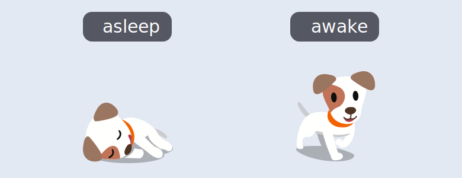

A dog is always **asleep** or **awake**. The dog can’t be asleep and awake at the same time, and it’s impossible for the dog to be neither asleep nor awake. There’s only these two states, a precisely limited, _finite_ number of states.

## Transitions and events

How the dog goes between **asleep** and **awake** is through _transitions_, which are symbolised by an arrow pointing from one state to the next state in the process’s sequence.

<!-- no alt because the image is already described in the surrounding text -->

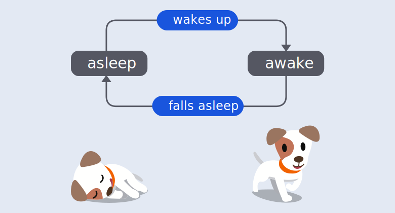

A transition is caused by an _event_ that results in the change of state. Transitions are labelled with their events.

Transitions and events are _deterministic_. Deterministic means that each transition and event always points to the same next state, and always produces the same result from their given starting condition, every time the process is run. Dogs never **wake up** to become **asleep** or **fall asleep** to become **awake**.

This tiny dog process, with its two finite states and two transitions is a _Finite State Machine._ A state machine is used to describe the behavior of something. The machine describes the thing’s states and the transitions between those states. It’s a Finite State Machine because it has a finite number of states. (Sometimes abbreviated to FSM by folks who love jargon).

## Initial state

Any process that has states will have an _initial state_, the default state the process exists in until an event happens to change the process’s state.

The initial state is represented by a filled circle with an arrow pointing from the circle to the initial state.

<!-- no alt because the image is already described in the surrounding text -->

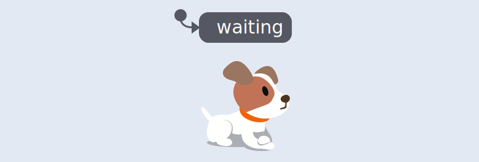

Using a statechart to describe the process of walking the dog, the initial state would be **waiting** to walk.

## Final state

Most processes with states will have a _final state_, the last state when the process is finished. The final state is represented by a double border on the state’s rounded rectangle box.

In the dog walking statechart, the final state would be **walk complete**.

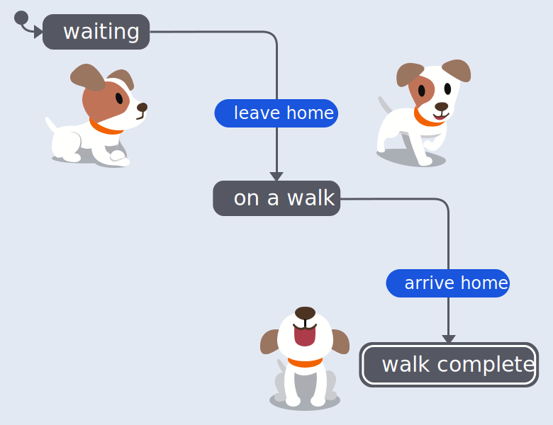

## Compound states

A compound state is a state that can contain more states, also known as child states. These child states can only happen when the parent compound state is happening. Inside the **on a walk** state, there could be the child states of **walking**, **running** and **stopping to sniff good smells**.

A compound state is symbolised by a labelled rounded rectangle box that acts as a container for its child states.

<!-- no alt because the image is already described in the surrounding text -->

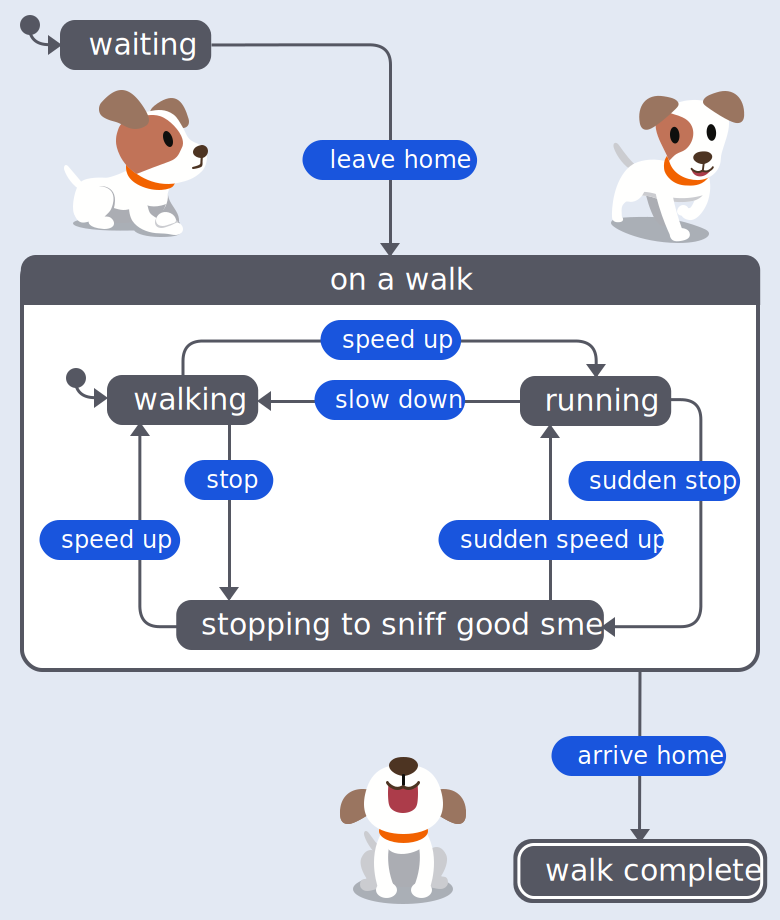

A compound state should also specify which child state is the initial state. In the **on a walk** compound state, the initial state is **walking**.

Compound states are what makes statecharts capable of handling more complexity than an everyday state machine.

### Atomic states

An atomic state is a state that doesn’t have any child states. **Waiting**, **walk complete**, **walking**, **running** and **stopping to sniff good smells** are all atomic states.

### Parallel states

A parallel state is a compound state where all of its child states, also known as regions, are active simultaneously. The regions are separated inside the compound state container by a dashed line.

Inside the **on a walk** compound state, there could be two regions. One region contains the dog’s activity child states of **walking**, **running** and **stopping to sniff good smells**, and the other region containing the dog’s tail states of **wagging** and **not wagging**. The dog can walk and wag its tail, run and wag its tail or stop and sniff while wagging its tail, it can also do any of these activities without wagging its tail.

<!-- no alt because the image is already described in the surrounding text -->

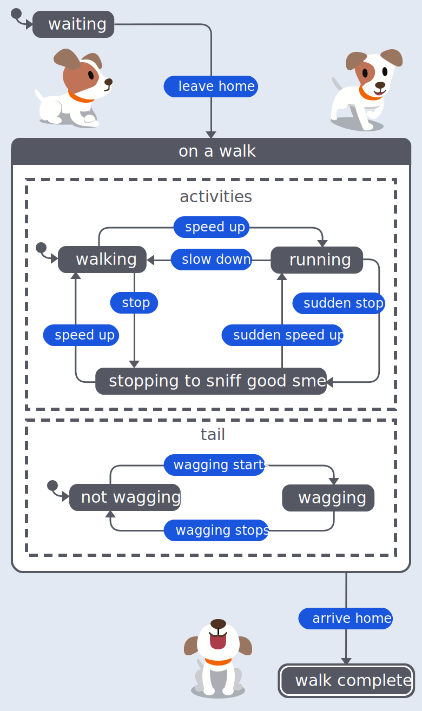

Both regions should also specify which child state is the initial state. In our **tail** region, the initial state is **not wagging**.

### Self-transition

A self-transition is when an event happens, but the transition returns to the same state. The transition arrow exits and re-enters the same state.

A helpful way to describe a self-transition is “doing something, not going somewhere” in the process.

In a **dog begging** process, there would be a **begging** state with a **gets treat** event. And for the dogs who love their food, no matter how many times you go through the **gets treat** event, the dog returns to its **begging** state.

<!-- no alt because the image is already described in the surrounding text -->

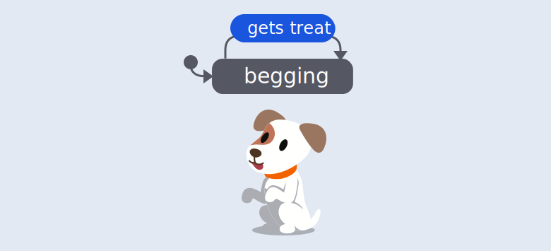

## Planning statecharts

One of the benefits of statecharts is that, in the process of putting a statechart together, you explore all the possible states in your process. This exploration will help you avoid bugs and errors in your code as you’re more likely to cover all the eventualities.

And because statecharts are executable, they can behave as both the diagram and the code, making it less likely that you’ll introduce differences or bugs interpreting between the diagramming and coding environments.

### Planning a statechart for a login machine

To draw a statechart for a login machine, start by listing the basic _events_ in the process. Think about what your login process will _do_:

- log in
- log out

Then list the _states_ that exist as a result of those events:

- logged in
- logged out

Once there’s some events and states, there’s the beginnings of a statechart.

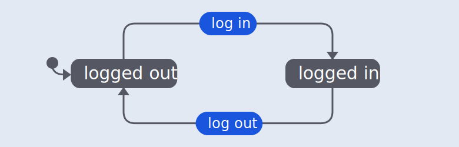

Don’t forget the _initial state_. In this case, the **logged out** state is the initial state, as any new user would come to the process logged out.

## Delayed transitions

Some login and logout processes will log out an inactive user after a fixed length of time as a security measure.

The **active** and **idle** states only happen when the user is logged in, so these become child states inside the **logged in** compound state.

<!-- no alt because the image is already described in the surrounding text -->

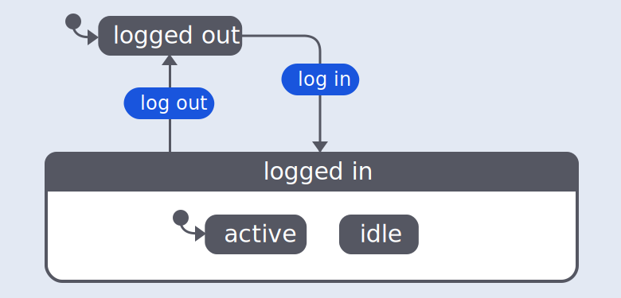

The initial state inside the **logged in** compound state is **active**, as it happens as a direct result of the **log in** event, and logging in is a sign of user activity.

A _delayed transition_ is a type of transition which happens after being in a state for a specified length of time. The delayed transition is labelled with “after” and a fixed duration to indicate how much time should pass before transitioning to the next indicated state.

In the login statechart, a delayed transition of **60000** milliseconds, or 1 minute, follows the **active** state to determine whether the user is **idle**. If there is an **activity** event before the transition reaches one minute, the process returns to the **active** state.

<!-- no alt because the image is already described in the surrounding text -->

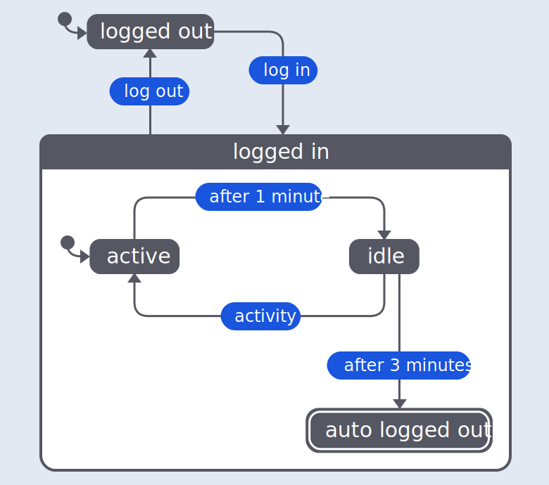

A delayed transition of **180000** milliseconds, or 3 minutes, follows the **idle** state to transition to the **auto logged out** state if the user remains idle.

## Actions

A statechart is used to set off _actions_ in the system outside of the statechart. Actions are also commonly known as _effects_ or _side-effects_. “Side effects” sounds like a negative or unimportant term, but setting off actions is the primary purpose in using statecharts.

Actions are events that have no impact or consequences for the rest of the sequence, the event is just triggered and the sequence moves on to the next step in the process. For example, the login statechart might execute actions that change the user interface.

An _action_ can be fired upon entering or exiting a state, or on a transition. An action on a state is included inside the state’s container with an “entry /” or “exit /” label depending on whether the action should be fired on entry or exit from the state.

In the login statechart, there’s an _entry_ action on the **idle** state to warn the user that they may be logged out.

<!-- no alt because the image is already described in the surrounding text -->

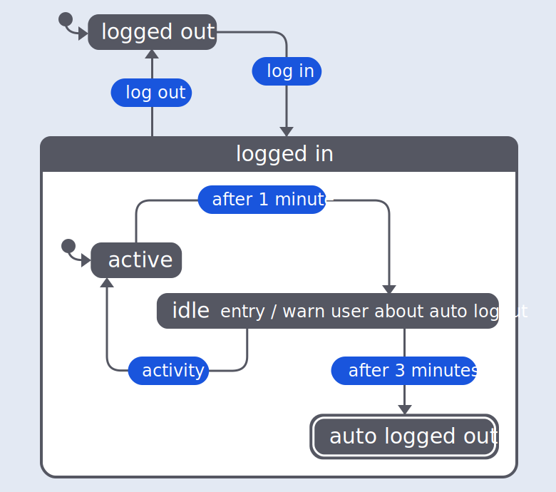
