# Visualizer

The [XState Visualizer](https://stately.ai/viz) is a tool for creating and inspecting statecharts to visualize the state of your applications.

As a visual tool, the Visualizer helps developers get an overview of their application logic, as well as making it easy to share and with designers, project managers and the rest of the team.

<iframe src="https://stately.ai/viz/embed/7c0ec648-09d6-46fe-a912-fc0e46da5094?mode=viz&panel=code&readOnly=1&showOriginalLink=1&controls=0&pan=0&zoom=0"
allow="accelerometer; ambient-light-sensor; camera; encrypted-media; geolocation; gyroscope; hid; microphone; midi; payment; usb; vr; xr-spatial-tracking"
sandbox="allow-forms allow-modals allow-popups allow-presentation allow-same-origin allow-scripts"
></iframe>
<iframe src="https://stately.ai/viz/embed/7c0ec648-09d6-46fe-a912-fc0e46da5094?mode=panels&panel=code&readOnly=1&showOriginalLink=1"
allow="accelerometer; ambient-light-sensor; camera; encrypted-media; geolocation; gyroscope; hid; microphone; midi; payment; usb; vr; xr-spatial-tracking"
sandbox="allow-forms allow-modals allow-popups allow-presentation allow-same-origin allow-scripts"
></iframe>

- _Write_ your application logic and immediately visualize it.
- _Save_ your statecharts to the Stately Registry and share them with anybody.
- _Share_ your statecharts in your team’s documentation with embedded mode and live-updating snapshot images.

---

The Visualizer already has many features to help you make your code do more.

## Write and visualize your code

Write and visualize your code _instantly_

<iframe src="https://www.loom.com/embed/f614f08d1a77478c8377aa2686cef06e" frameborder="0" webkitallowfullscreen mozallowfullscreen allowfullscreen style="position: absolute; top: 0; left: 0; width: 100%; height: 100%;"></iframe>

1. Use the code editor in the **Code** tab to write your machine code.
2. Press **Visualize** to visualize your machine.

<!-- ## Visualize your machines in action

TODO: Visualize your machines in action in Inspect mode.

[Tango step-by-step example? Video?] -->

## Share your machines

There are multiple ways you can share your machines with your team and across the web.

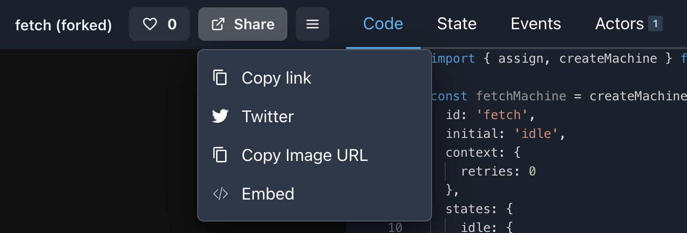

The share menu contains four options:

1. **Copy link**. Copy the Visualizer URL for the machine.
2. **[Twitter](#twitter-link)**. Composes a tweet with a link to the machine.
3. **[Copy Image URL](#live-updating-snapshot-images)**. Copies a URL for a snapshot image of the machine.
4. **[Embed](#embed-mode)**. Creates an embeddable iframe containing the machine.

### Twitter link

The Twitter link option in the share menu composes a tweet with a link to the machine’s Visualizer URL.

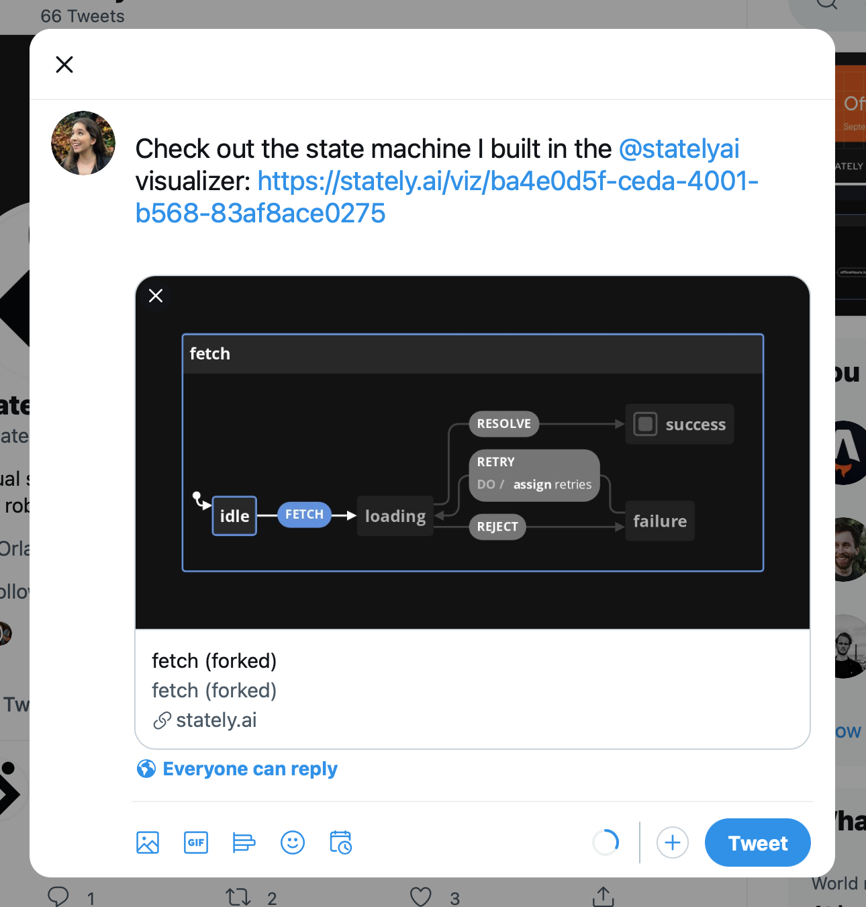

### Live-updating snapshot images

The Copy Image URL option in the share menu copies the URL for the image of the machine to your clipboard. The image is a snapshot of the machine, and will update with any changes to your machine.

The image below is a snapshot of [David’s example fetch machine](https://stately.ai/viz/7c0ec648-09d6-46fe-a912-fc0e46da5094).

### Embed mode

The Embed option in the share menu opens an options panel for an embeddable iframe of the machine.

Copy the code from the text area and paste it wherever you want to embed the machine. The machine can be embedded anywhere you can use iframes.

<iframe src="https://www.loom.com/embed/82da5f9ce99444a9849cbdbb55942468" frameborder="0" webkitallowfullscreen mozallowfullscreen allowfullscreen style="position: absolute; top: 0; left: 0; width: 100%; height: 100%;"></iframe>

The embedded machine below is [David’s example fetch machine](https://stately.ai/viz/7c0ec648-09d6-46fe-a912-fc0e46da5094) in full mode with an active state panel, no link to the Visualizer, and control buttons enabled with panning and zooming both enabled:

<iframe src="https://stately.ai/viz/embed/7c0ec648-09d6-46fe-a912-fc0e46da5094?mode=full&panel=state&readOnly=1&showOriginalLink=0&controls=1&pan=1&zoom=1"
allow="accelerometer; ambient-light-sensor; camera; encrypted-media; geolocation; gyroscope; hid; microphone; midi; payment; usb; vr; xr-spatial-tracking"
sandbox="allow-forms allow-modals allow-popups allow-presentation allow-same-origin allow-scripts"
></iframe>

You can choose from a number of options for your embedded machine:

#### Mode option

The default mode is **viz**.

- **viz**: Show only the Visualizer in the embedded iframe.
- **panels**: Show only the **Code**, **State**, **Events** and **Actors** panels in the embedded iframe.
- **full**: Show both the Visualizer and the **Code**, **State**, **Events** and **Actors** panels in the embedded iframe.

#### Show control buttons option

In **viz** and **full** modes, there are further options to show the control buttons for the Visualizer. When **show control buttons** is selected, there are additional options to **Allow panning** and **Allow zooming**. If these options are not selected, the buttons will be visible but disabled.

#### Panel options

In **panels** and **full** modes, there are further options to select the **active panel**, make the Editor readonly, and show the original link to the Visualizer.

## Fork existing machines

Found a useful machine in [the Registry](https://stately.ai/registry)?

You can fork the machine, using the **Fork** button, and make it work for your own uses.

<!-- ## Import existing machines

Import existing machines from GitHub gists -->

## Useful error messages

The Visualizer has descriptive error messages to help you understand and correct the issue when your code can’t be visualized.

  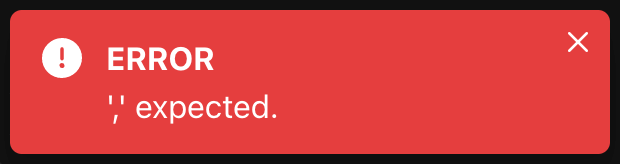
  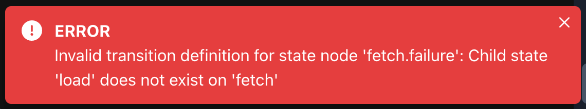
  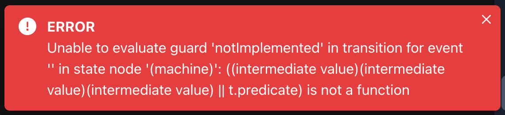

The error will fade away after 4 seconds. Press **Visualize** to view the error again.

## Custom code editor themes

In the Visualizer’s settings you can choose from thirteen color themes for the code editor, including the default **XState Viz** theme.

<ul class="gallery">
  <li>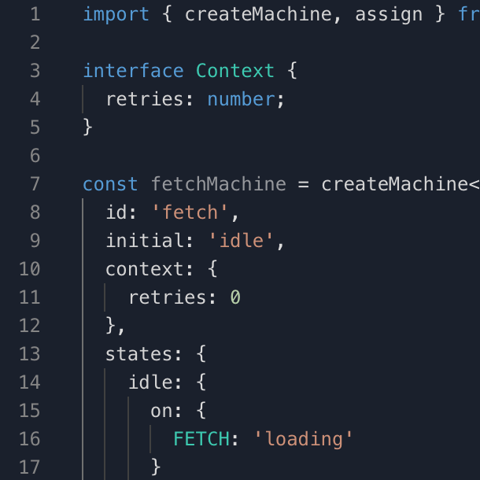<strong>XState Viz</strong></li>
  <li>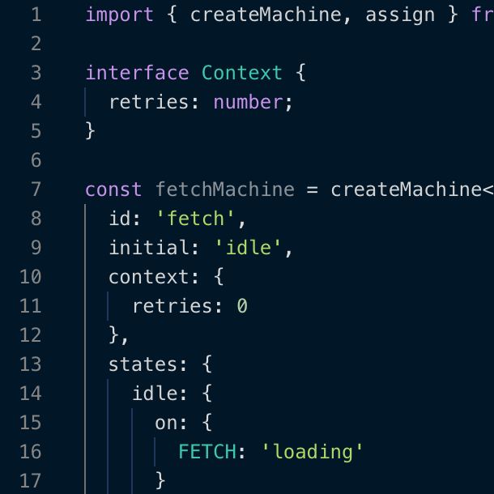<strong>Night Owl</strong></li>
  <li>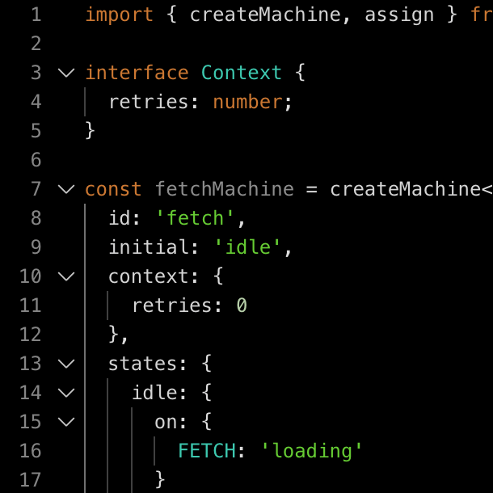<strong>All Hallows Eve</strong></li>
  <li>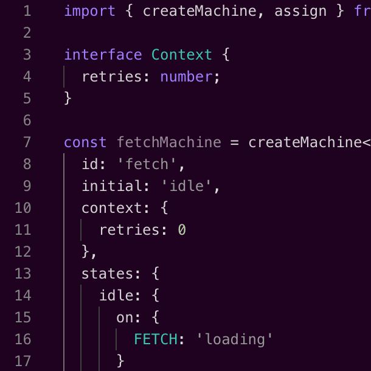<strong>Amy</strong></li>
  <li>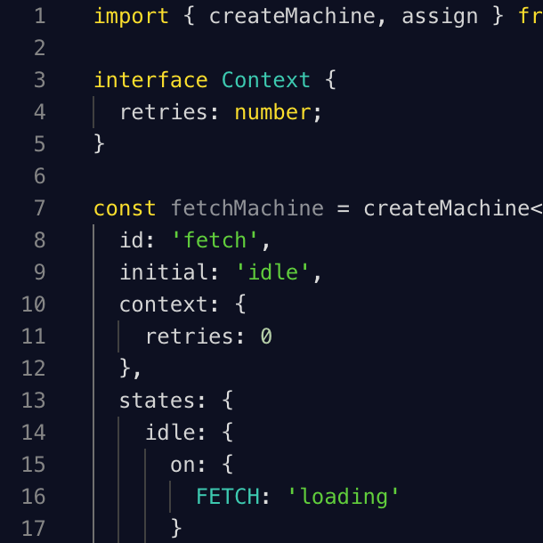<strong>Blackboard</strong></li>
  <li>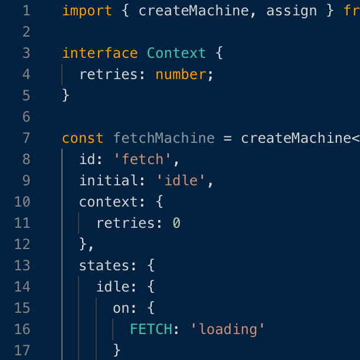<strong>Cobalt</strong></li>
  <li>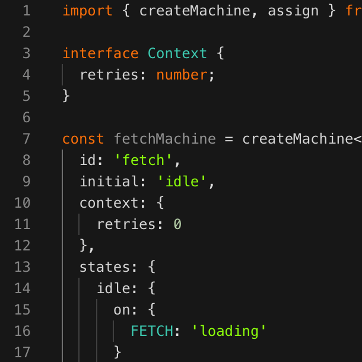<strong>Merbivore Soft</strong></li>
  <li>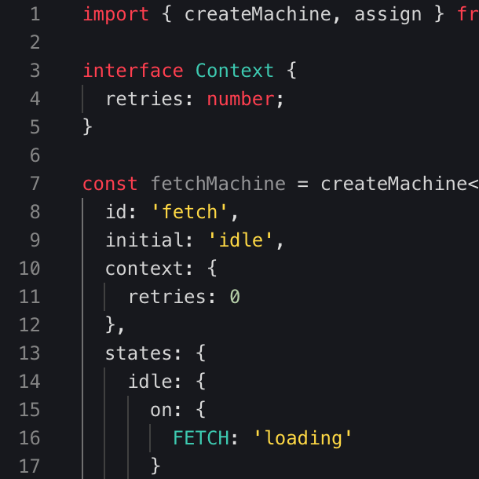<strong>Monokai</strong></li>
  <li>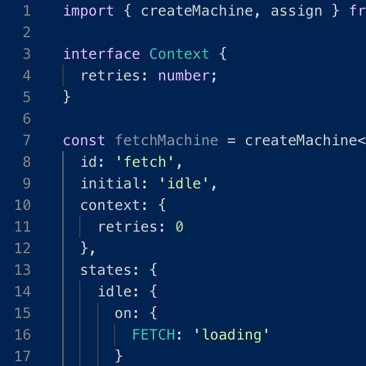<strong>Tomorrow Night</strong></li>
  <li><strong>Poimandres</strong></li>
  <li>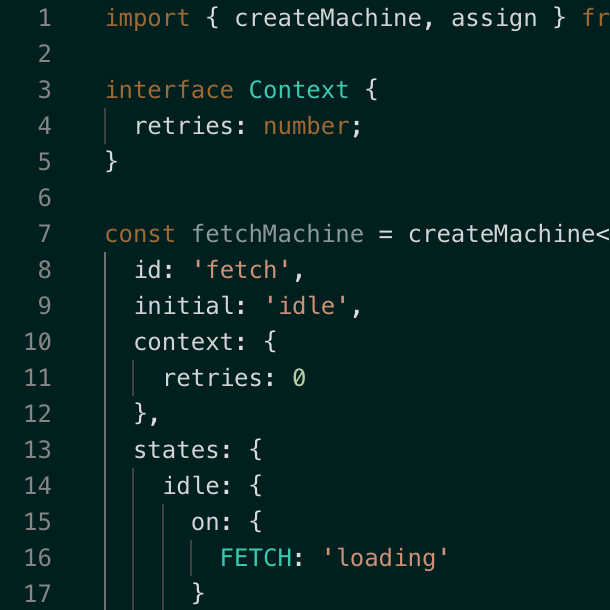<strong>Garden of Atlantis</strong></li>
  <li>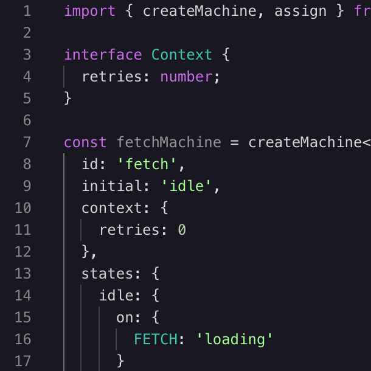<strong>Martian Night</strong></li>
  <li>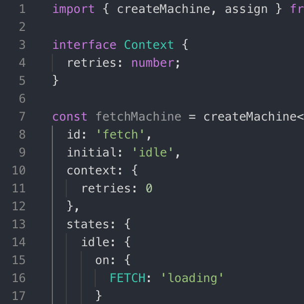<strong>Atom One Dark</strong></li>
</ul>

### How to change the code editor’s color theme

1. Go to Settings using the button in the top menubar.
2. Scroll down to the **Editor Theme** section.
3. Choose your preferred theme from the dropdown menu.
4. Go back to the Code view using the **Code** button in the top menubar.

## View controls

  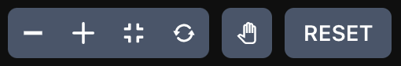

The view controls panel helps you navigate around your statechart.

<iframe src="https://www.loom.com/embed/806824c22a97421694f0aa45a74b91e8" frameborder="0" webkitallowfullscreen mozallowfullscreen allowfullscreen style="position: absolute; top: 0; left: 0; width: 100%; height: 100%;"></iframe>

<ul class="icon-list">
  <li><strong>Zoom out</strong>. Zoom out of the canvas to view more of your statechart.</li>
  <li><strong>Zoom in</strong>. Zoom into the canvas to view details in your statechart.</li>
  <li><strong>Fit to view</strong>. Fit your entire statechart into the available viewing space.</li>
  <li><strong>Reset canvas</strong>. Reset the statechart’s position to the top left of the viewing space at 100% zoom level.</li>
  <li><strong>Hand tool</strong>. Select the hand tool to enter press and drag mode. Then press, hold and drag to move around the canvas. To exit press and drag mode, deselect the hand tool.</li>
  <li><strong>Reset button</strong>. Reset the statechart’s sequence to its initial state.</li>
</ul>

## Keyboard shortcuts and command palette

You can use keyboard shortcuts for common Visualizer commands. Find the list of **Keyboard shortcuts** in the Settings.

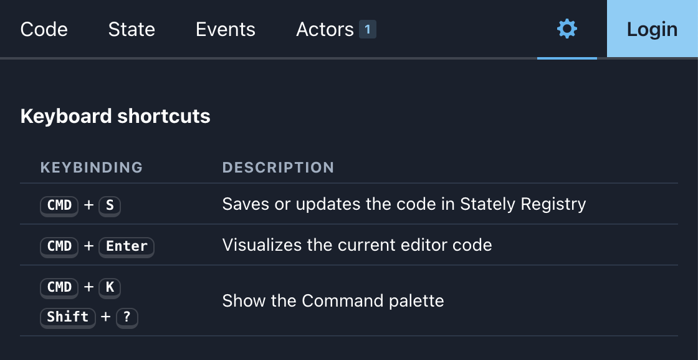

<iframe src="https://www.loom.com/embed/fedfec4a3ad5471d9f72a4c611ea9ee8" frameborder="0" webkitallowfullscreen mozallowfullscreen allowfullscreen style="position: absolute; top: 0; left: 0; width: 100%; height: 100%;"></iframe>

- <kbd>CMD</kbd> + <kbd>S</kbd> Saves or updates the code in [Stately Registry](https://stately.ai/registry).
- <kbd>CMD</kbd> + <kbd>Enter</kbd> Visualizes the current editor code.
- <kbd>CMD</kbd> + <kbd>K</kbd> Show the Command palette.
- <kbd>Shift</kbd> + <kbd>?</kbd> Show the Command palette.

### Command palette

Use the <kbd>CMD</kbd> + <kbd>K</kbd> or <kbd>Shift</kbd> + <kbd>?</kbd> keyboard shortcut to show the **command palette**. The command palette gives you quick access to common Visualizer commands.

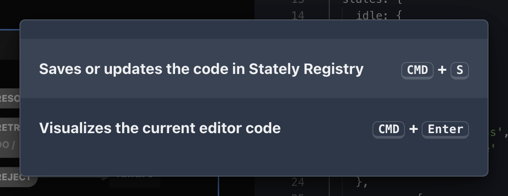

The command palette will have more commands in the future.

## And more…

- Sign in with GitHub
- Auto-saves locally so you won’t lose your work

## Upcoming features

We’ve got many more features coming soon. Including:

- Support for Lucy DSL (domain-specific language)
- Custom event and event payload support

## Get involved

[Take me to the Visualizer!](https://stately.ai)

[Try the Visualizer in Inspect mode](https://stately.ai/viz?inspect)

The Visualizer is available now and will be free and open source forever. Contributions are welcome!

### Feedback and bug reports

If you have any feedback or have any feature requests, please [join our Discord server](https://discord.gg/xstate) where you’ll find our team and the wonderful XState community.

Please [submit any bug reports as GitHub issues on the XState repository](https://github.com/statelyai/xstate/issues).
