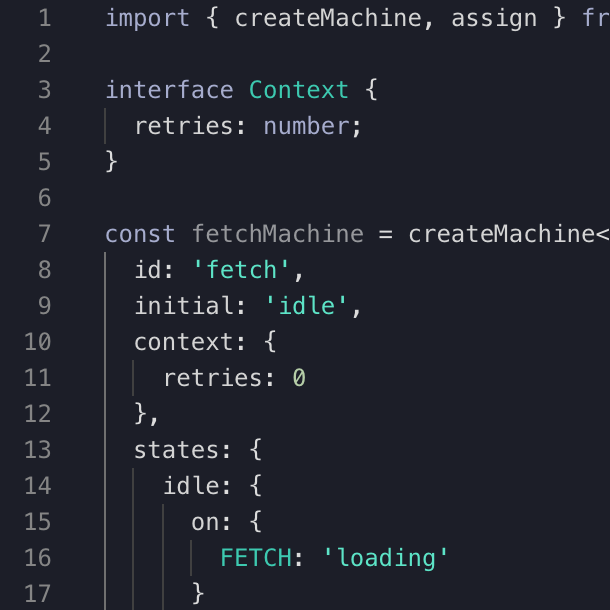

# Visualizer

The [XState Visualizer](https://stately.ai/viz) is a tool for creating and inspecting statecharts to visualize the state of your applications.

As a visual tool, the Visualizer helps developers get an overview of their application logic, as well as making it easy to share and with designers, project managers and the rest of the team.

[Video introducing the viz basics]

- _Write_ your application logic and immediately visualize it.
- _Save_ your statecharts to the Stately Registry and share them with anybody.
- _Share_ your statecharts in your team’s documentation with embedded mode and live-updating snapshot images.

## Features

The Visualizer already has many features to help you make your code do more.

### Write and visualize your code _instantly_

[Tango step-by-step example? Video?]

### Visualize your machines in action in Inspect mode

[Tango step-by-step example? Video?]

### Share your machines in your documentation, blogs and anywhere on the web with embed mode

[Tango step-by-step example? Video?]

Embed mode can be used anywhere you can use iframes.

### Share your machines everywhere with live-updating snapshot images

[Tango step-by-step example? Video?]

### Import existing machines from GitHub gists

[screenshot/s with description?]

### Useful error messages

[screenshot with description?]

### Custom themes for the code editor

In the Visualizer’s settings you can choose from thirteen color themes for the code editor, including the default **XState Viz** theme.

<ul class="gallery">
  <li><strong>XState Viz</strong></li>
  <li><strong>Night Owl</strong></li>
  <li><strong>All Hallows Eve</strong></li>
  <li><strong>Amy</strong></li>
  <li><strong>Blackboard</strong></li>
  <li><strong>Cobalt</strong></li>
  <li><strong>Merbivore Soft</strong></li>
  <li><strong>Monokai</strong></li>
  <li><strong>Tomorrow Night</strong></li>
  <li><strong>Poimandres</strong></li>
  <li><strong>Garden of Atlantis</strong></li>
  <li><strong>Martian Night</strong></li>
  <li><strong>Atom One Dark</strong></li>
</ul>

#### How to change the code editor’s color theme

1. Go to Settings using the button in the top menubar.
2. Scroll down to the **Editor Theme** section.
3. Choose your preferred theme from the dropdown menu.
4. Go back to the Code view using the **Code** button in the top menubar.

### Zoom and pan to get an overview of your statechart

[gif/video with description?]

### Keyboard shortcuts and command palette

[screenshot with description?]

### And more

- Login with GitHub
- Auto-saves locally so you won’t lose your work

## Upcoming features

We’ve got many more features coming soon. Including:

- Support for Lucy DSL (domain-specific language)
- Custom event and event payload support

## Get involved

[Take me to the Visualizer!](https://stately.ai)

[Try the Visualizer in Inspect mode](https://stately.ai/viz?inspect)

The Visualizer is available now and will be free and open source forever. Contributions are welcome!

### Feedback and bug reports

If you have any feedback or have any feature requests, please [join our Discord server](https://discord.gg/xstate) where you’ll find our team and the wonderful XState community.

Please [submit any bug reports as GitHub issues on the XState repository](https://github.com/statelyai/xstate/issues).
