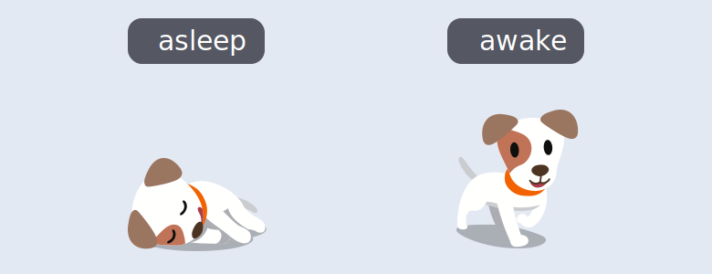
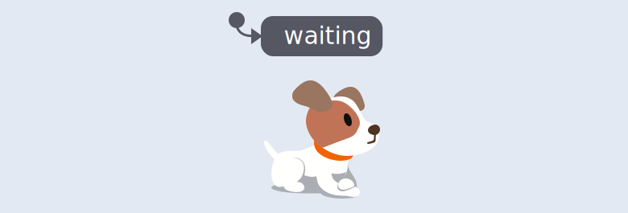
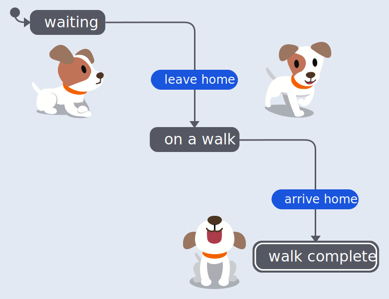
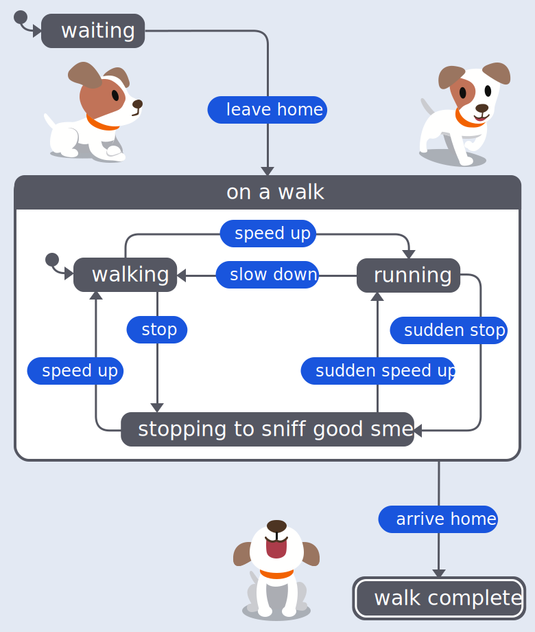
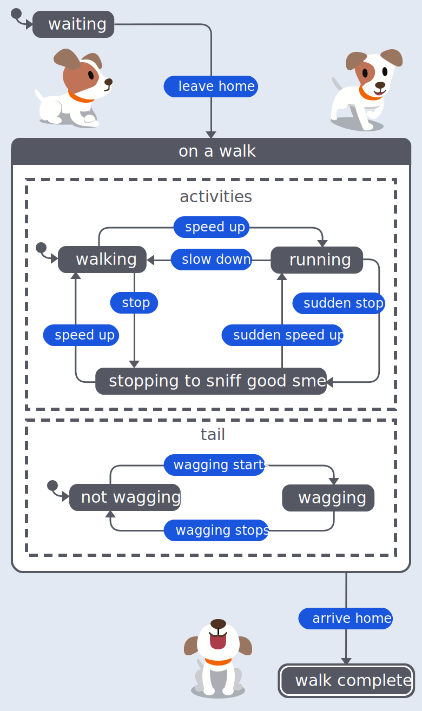
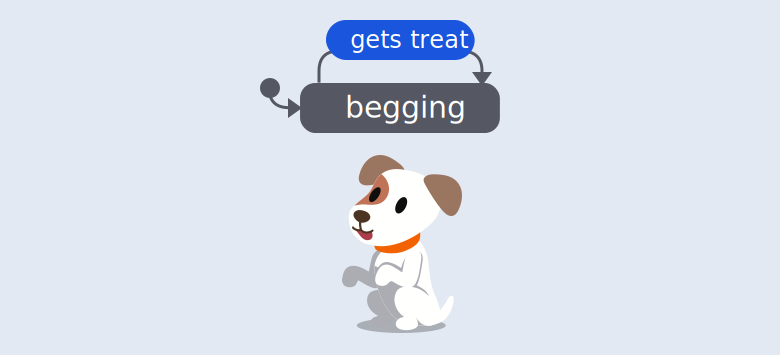
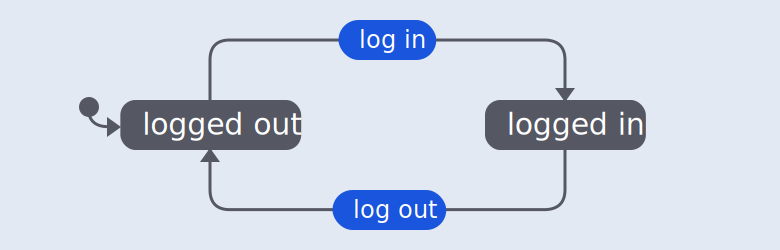
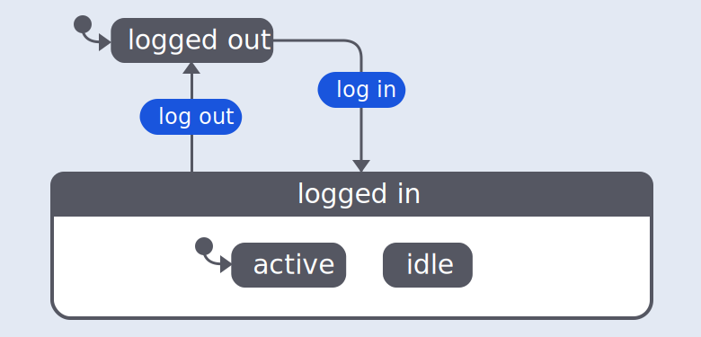
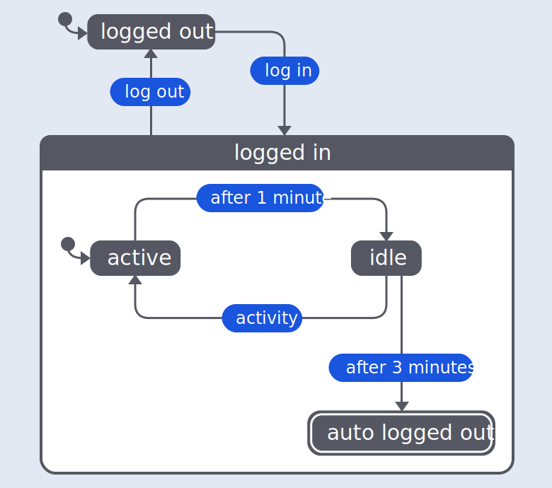
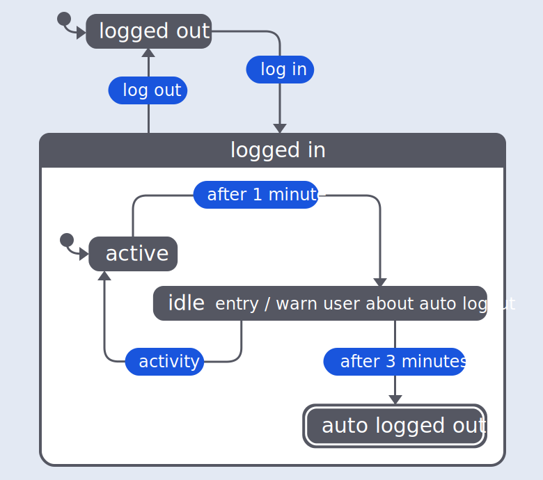

# 状态机和状态图简介

状态图（statecharts）是一种图形语言，它用来描述过程中的状态。

你可能也用过类似的图，来设计用户流程图、规划数据库、或者构建 APP 架构。状态图（statecharts）是换种方式，用一堆盒子和箭头，来给人展示什么叫流程。不过，有了 XState，我们就能用代码来管理应用逻辑了。

这篇指南，会用初学者友好的方式，给你讲讲状态图（statecharts） 基础，内容如下：

- [状态 states](#states)
- [转换与事件 transitions and events](#transitions-and-events)
- [初始状态 initial states](#initial-state)
- [最终状态 final states](#final-state)
- [复合状态 compound states](#compound-states)
- [并行状态 parallel states](#parallel-states)
- [自转换 self-transitions](#self-transition)
- [计划状态图 planning statecharts](#planning-statecharts)
- [延迟状态图 delayed transitions](#delayed-transitions)
- [动作 actions](#actions)

## 状态 States

我们用圆角矩形盒子来展示 _状态_。为狗的过程，绘制状态图，首先会想到两种状态：

<!-- no alt because the image is already described in the surrounding text -->

狗总是 **睡着（asleep）** 或 **醒着（awake）**。狗不能同时睡着和醒着，狗也不可能不睡不醒。只有这两种状态，没其它的了，这就是我们说的有限数量的状态。

## 转换与事件 Transitions and events

狗在 **睡着** 和 **醒着** 之间的变化，是通过转换来表示的，它用一个箭头表示，从一个状态指向过程序列中的下一个状态。

<!-- no alt because the image is already described in the surrounding text -->

转换（transition）是由导致状态更改的 **事件（event）** 引起的。用事件来标记转换。

转换和事件是 **确定性** 的。 确定性意味着每个转换和事件总是指向相同的下一个状态，并且每次进程运行时总是从给定的起始条件产生相同的结果。 你永远不会把狗摇醒后，它还 **睡着** ，或打晕它 它还 **醒着** 吧。

小狗具有两个有限状态，和两个转换的过程，就是一个 _有限状态机_。 状态机用于描述某事物的行为。 状态机描述事物的状态，以及这些状态之间的转换。 它是一个有限状态机，因为它具有有限数量的状态。（缩写为 FSM）

## 初始状态 Initial state

任何具有状态的事物，都会有一个 _初始状态_，即进程存在的默认状态，直到发生事件，从而改变事物的状态。

初始状态用实心圆圈表示，箭头从圆圈指向初始状态。

<!-- no alt because the image is already described in the surrounding text -->

用状态图来描述遛狗的过程，初始状态会是 **等待（waiting）** 走路。

## 最终状态 Final state

大多数具有状态的进程都会有一个 _最终状态_，即进程完成时的最后一个状态。 最终状态由状态圆角矩形框上的双边框表示。

在遛狗状态图中，最终状态是 **溜狗完成（walk complete）**。

## 复合状态 Compound states

复合状态是可以包含更多状态的状态，也称为子状态。 这些子状态只能在父级复合状态发生时发生。在遛狗（on a walk）状态中，可以有 **走路中（walking）**、 **奔跑中（running）** 和 **停下来闻闻好闻的气味（stopping to sniff good smells）** 几个子状态。

复合状态由标记的圆角矩形框表示，该框充当其子状态的容器。

<!-- no alt because the image is already described in the surrounding text -->

复合状态还应指定哪个子状态是初始状态。 在 **on a walk** 状态下，初始状态为 **walking**。

复合状态使状态图能够处理比日常状态机更复杂的情况。

### 原子状态 Atomic states

原子状态是没有任何子状态的状态。**等待（Waiting）**, **遛狗完成（walk complete）**, **走路（walking）**, **奔跑（running）** 和 **停下来闻闻好闻的（stopping to sniff good smells）** 都是原子状态。

### 并行状态 Parallel states

并行状态是一种复合状态，其中所有子状态（也称为区域）同时处于活动状态。 这些区域在复合状态容器内由虚线分隔。

在 **on a walk** 复合状态内，可能有两个区域。 一个区域包含狗的 **walking**、 **running** 和 **stopping to sniff good smells** 的活动子状态，另一个区域包含狗的尾巴 **摇动（wagging）** 和 **不摇动（not wagging）** 状态。 狗可以走路和摇尾巴，跑和摇尾巴，或者在摇尾巴的同时停下来闻，它也可以在不摇尾巴的情况下进行任何这些活动。

<!-- no alt because the image is already described in the surrounding text -->

两个区域还应该指定哪个子状态是初始状态。 在我们的 **tail** 区域，初始状态是 **not wagging**。

### 自转换 Self-transition

自转换是指事件发生但转换返回到相同状态时。 转换箭头退出并重新进入相同的状态。

描述自我转变的一种有用方法是在过程中“一直做某事，但一直没变化”。

在狗讨好的过程中，会有一个 **讨好（begging）** 状态和一个 **获得好处（gets treat）** 事件。 而对于爱吃的狗来说，无论你经历了多少次得到 **gets treat** 事件，狗都会回到 **begging** 状态。

<!-- no alt because the image is already described in the surrounding text -->

## 计划状态图 Planning statecharts

状态图的好处之一是，在将状态图放在一起的过程中，你可以发觉过程中的所有可能状态。 这种探索将帮助你避免代码中的错误，因为能让你覆盖到所有的事件变化。

而且由于状态图是可执行的，它们既可以作为图表，也可以作为代码，从而减少在图表和编码环境之间引入差异或错误解释的可能性。

### 为登录状态机计划一个状态图 Planning a statechart for a login machine

要绘制登录状态机的状态图，首先要列出流程中的基本事件。 想想你的登录过程会 _做_ 什么：

- 登进 log in
- 登出 log out

然后列出由于这些事件而存在的 _状态_：

- 已登进 logged in
- 已登出 logged out

一旦有了一些事件和状态，状态图就开始了。

不要忘记 _初始状态_。 在这种情况下，**logged out** 状态是初始状态，因为任何新用户都会进入未登录过程。

## 延迟转换 Delayed transitions

作为安全措施，某些登进和登出的过程，会在固定时间后，登出非活动用户。

**活动（active）** 和 **空闲（idle）** 状态仅在用户登进时发生，因此它们成为 **登进（logged in）** 复合状态中的子状态。

<!-- no alt because the image is already described in the surrounding text -->

**logged in** 复合状态中的初始状态是 **active**，因为它是 **log in** 事件的直接结果，登录是用户活动的标志。

_延迟转换（delayed transition）_ 是一种在处于某种状态，达到指定时间长度后，发生的转换。 延迟的转换被标记为“之后”和一个固定的持续时间，以指示在转换到下一个指示状态之前应该经过多长时间。

在登进状态图中，**60000** 毫秒或 1 分钟的延迟转换跟随 **active** 状态来确定用户是否 **idle**。 如果在转换达到一分钟之前有 **activity** 事件，则流程返回 **active** 状态。

<!-- no alt because the image is already described in the surrounding text -->

如果用户保持 **idle** 状态，则在空闲状态之后会延迟 **180000** 毫秒（或 3 分钟）转换到 **自动登出（auto logged out）** 状态。

## 动作 Actions

状态图使用，在状态图之外系统触发的 _actions_。 动作通常也称为 _作用（effects）_ 或 _副作用（side-effects）_。 “副作用”听起来像是一个消极或不重要的术语，但引发动作，是使用状态图的主要目的。

动作事件，对后续的其余部分没有影响，事件只是被触发，流程还是原来设置的那样，走下一步。 例如，登录状态图可能会执行更改用户界面的操作。

可以在进入或退出状态或转换时触发 _动作_。状态的操作包含在状态容器内，带有“entry /” 或 “exit /”标签，具体取决于动作是在进入还是退出状态时触发。

在登录状态图中，**idle** 状态有一个进入动作来警告用户他们可能会被登出。

<!-- no alt because the image is already described in the surrounding text -->

