# 可视化工具

[XState Visualizer](https://stately.ai/viz) 是一种通过可视化你的应用状态的方式，用于创建和检查状态图的工具。

作为一种可视化工具，Visualizer 可帮助开发人员了解他们的应用程序逻辑，并使其易于与设计人员、项目经理和团队其他成员共享。

<iframe src="https://stately.ai/viz/embed/7c0ec648-09d6-46fe-a912-fc0e46da5094?mode=viz&panel=code&readOnly=1&showOriginalLink=1&controls=0&pan=0&zoom=0"
allow="accelerometer; ambient-light-sensor; camera; encrypted-media; geolocation; gyroscope; hid; microphone; midi; payment; usb; vr; xr-spatial-tracking"
sandbox="allow-forms allow-modals allow-popups allow-presentation allow-same-origin allow-scripts"
></iframe>
<iframe src="https://stately.ai/viz/embed/7c0ec648-09d6-46fe-a912-fc0e46da5094?mode=panels&panel=code&readOnly=1&showOriginalLink=1"
allow="accelerometer; ambient-light-sensor; camera; encrypted-media; geolocation; gyroscope; hid; microphone; midi; payment; usb; vr; xr-spatial-tracking"
sandbox="allow-forms allow-modals allow-popups allow-presentation allow-same-origin allow-scripts"
></iframe>

- _编写_ 你的应用程序逻辑，并立即将其可视化。
- _保存_ 你的状态图到 Stately Registry 并与任何人分享。
- _分享_ 你的状态图，可以嵌入到你的团队文档中使用，并能保证实时更新状态图。

---

Visualizer 已经有许多功能可以帮助你，使代码做得更多。

## 编写和可视化你的代码

_立即_ 编写和可视化你的代码

<iframe src="https://www.loom.com/embed/f614f08d1a77478c8377aa2686cef06e" frameborder="0" webkitallowfullscreen mozallowfullscreen allowfullscreen style="position: absolute; top: 0; left: 0; width: 100%; height: 100%;"></iframe>

1. 使用 **Code** 选项卡中的代码编辑器编写状态机代码。
2. 按 **Visualize** 可视化你的状态机。

<!-- ## Visualize your machines in action

TODO: Visualize your machines in action in Inspect mode.

[Tango step-by-step example? Video?] -->

## 分享你的状态机

你可以通过多种方式与团队和网络共享你的状态机。

共享菜单包含四个选项：

1. **Copy link**。 复制状态机的 Visualizer 链接。
2. **[Twitter](#twitter-link)**。 写一条带有状态机链接的 Twitter。
3. **[Copy Image URL](#live-updating-snapshot-images)**。 复制状态机快照图像的链接。
4. **[Embed](#embed-mode)**。 创建一个包含状态机可嵌入 iframe。

### Twitter 链接

共享菜单中的 Twitter 链接选项会撰写一条推文，其中包含指向状态机 Visualizer 的链接。

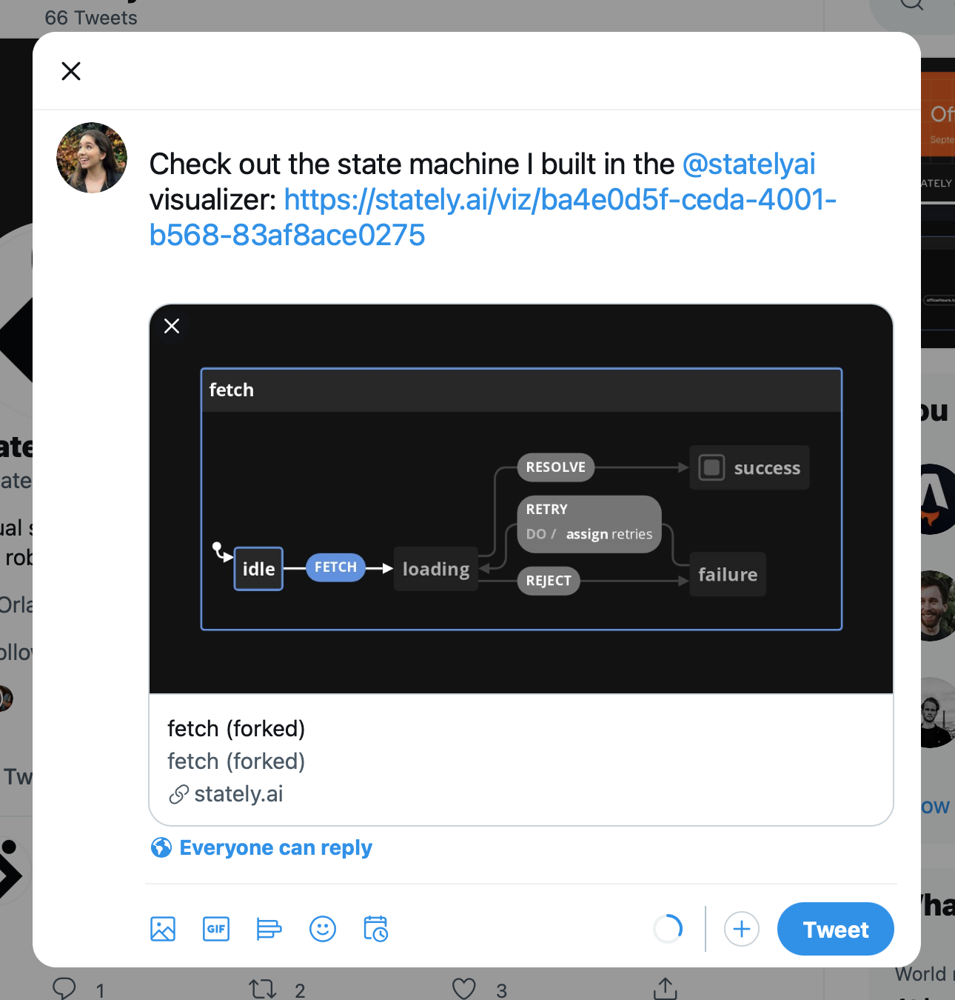

### 实时更新快照图像

共享菜单中的 Copy Image URL 选项将状态机图像的链接复制到剪贴板。该图像是状态机的快照，并且会随着你状态机的任何更改而更新。

下图是 [David’s example fetch machine](https://stately.ai/viz/7c0ec648-09d6-46fe-a912-fc0e46da5094) 的快照。

### 嵌入模式

共享菜单中的 Embed 选项为状态机的可嵌入 iframe 打开一个选项面板。

从文本域复制代码并将其粘贴到你想要嵌入状态机的任何位置。该状态机可以嵌入任何可以使用 iframe 的地方。

<iframe src="https://www.loom.com/embed/82da5f9ce99444a9849cbdbb55942468" frameborder="0" webkitallowfullscreen mozallowfullscreen allowfullscreen style="position: absolute; top: 0; left: 0; width: 100%; height: 100%;"></iframe>

下面的嵌入式状态机是 [David fetch 状态机示例](https://stately.ai/viz/7c0ec648-09d6-46fe-a912-fc0e46da5094) 在 State 面板激活的完整模式下，启用了平移和缩放的控制按钮：

<iframe src="https://stately.ai/viz/embed/7c0ec648-09d6-46fe-a912-fc0e46da5094?mode=full&panel=state&readOnly=1&showOriginalLink=0&controls=1&pan=1&zoom=1"
allow="accelerometer; ambient-light-sensor; camera; encrypted-media; geolocation; gyroscope; hid; microphone; midi; payment; usb; vr; xr-spatial-tracking"
sandbox="allow-forms allow-modals allow-popups allow-presentation allow-same-origin allow-scripts"
></iframe>

你可以为你嵌入式状态机从多个选项中进行选择：

#### 模式选项

默认模式是 **viz**。

- **viz**: 仅在嵌入的 iframe 中显示 Visualizer。
- **panels**: 在嵌入的 iframe 中仅显示 **Code**、**State**、**Events** 和 **Actors** 面板。
- **full**: 在嵌入的 iframe 中同时显示 Visualizer 和 **Code**、**State**、**Events** 和 **Actors** 面板。

#### 显示控制按钮选项

在 **viz** 模式和 **full** 模式下，还有更多选项可以显示 Visualizer 的控制按钮。当 **show control buttons** 被选中时, 还会显示 **Allow panning** 和 **Allow zooming**。 如果未选择这些选项，按钮将可见但被禁用。

#### 面板选项

在 **panels** 和 **full** 模式下，还有更多选项来选择 **active panel**，将编辑器设为只读以及显示到 Visualizer 的原始链接。

## 克隆 (Fork) 存在的状态机

在 [the Rgistry](https://stately.ai/registry) 找到可用状态机？

使用 **Fork** 按钮，你可以 fork 一个状态机以便你自己使用。

<!-- ## Import existing machines

Import existing machines from GitHub gists -->

## 有用的错误信息

在代码无法被可视化的时候，Visualizer 将提供具有描述性的错误消息，可帮助你发现和改正错误。

  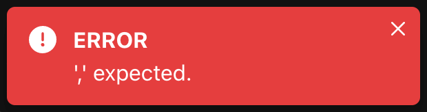
  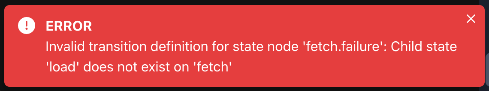
  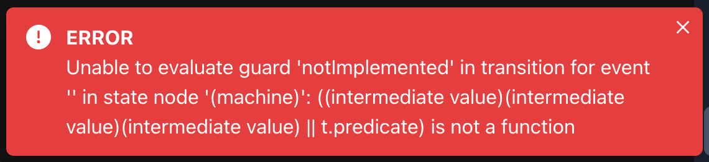

错误提示持续显示 4 秒. 点击 **Visualize** 可以再次查看错误。

## 自定义代码编辑器主题

在 Visualizer 的设置中，你可以为代码编辑器从 13 种颜色主题中选择一种主题，包括默认的 **XState Viz** 主题。

<ul class="gallery">
  <li>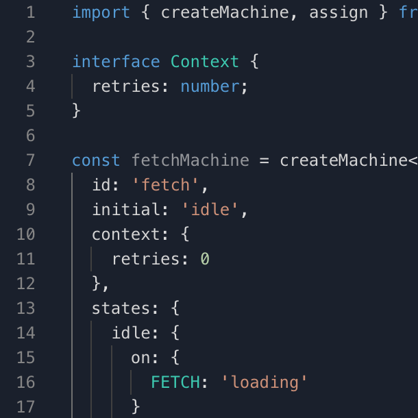<strong>XState Viz</strong></li>
  <li><strong>Night Owl</strong></li>
  <li>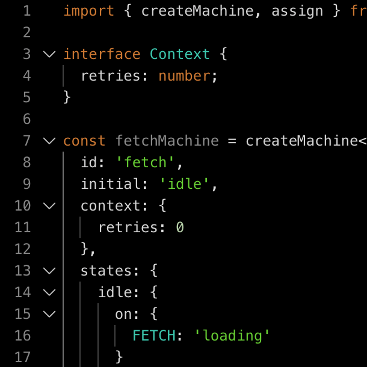<strong>All Hallows Eve</strong></li>
  <li>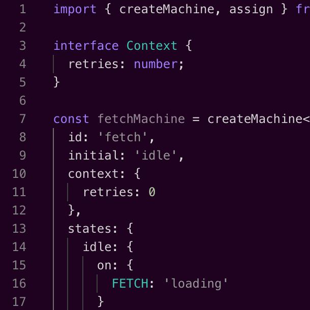<strong>Amy</strong></li>
  <li>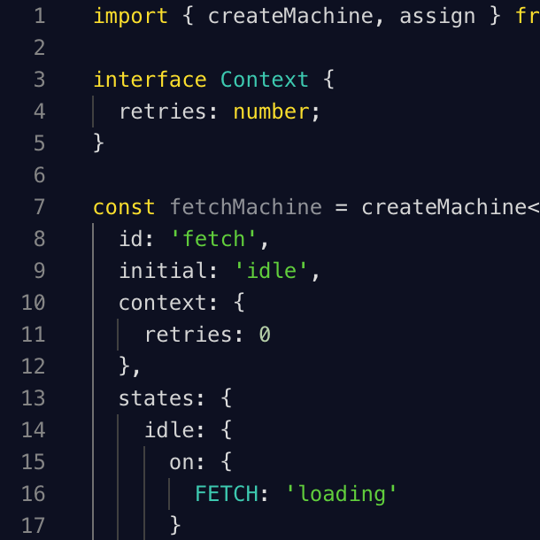<strong>Blackboard</strong></li>
  <li>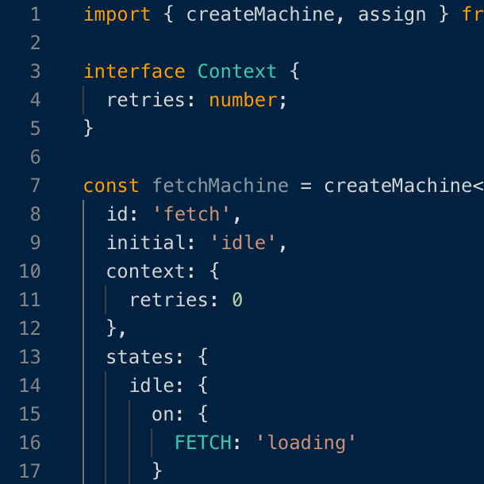<strong>Cobalt</strong></li>
  <li>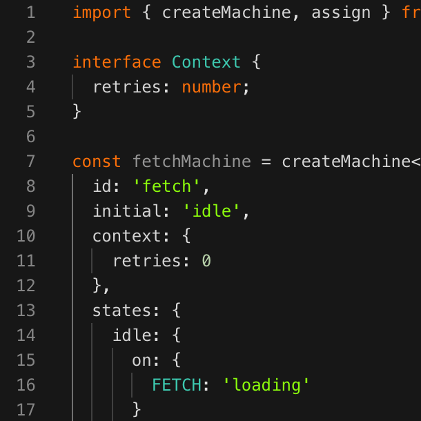<strong>Merbivore Soft</strong></li>
  <li>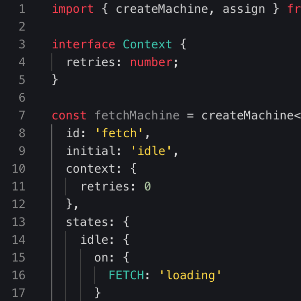<strong>Monokai</strong></li>
  <li>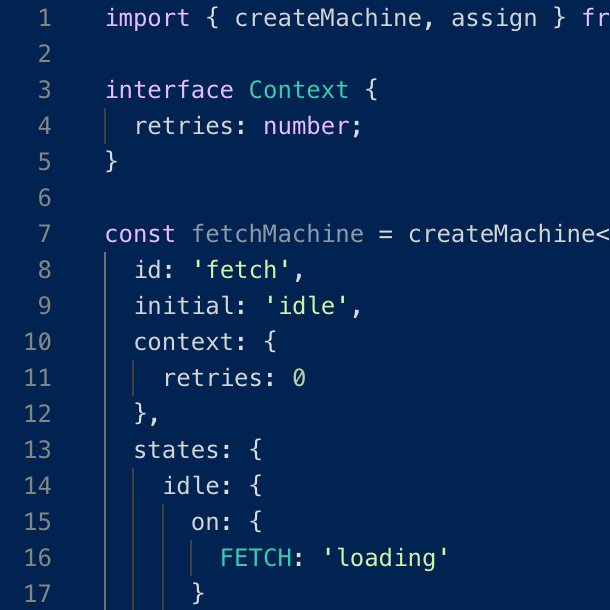<strong>Tomorrow Night</strong></li>
  <li>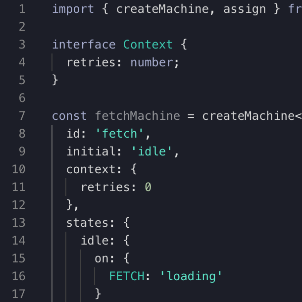<strong>Poimandres</strong></li>
  <li>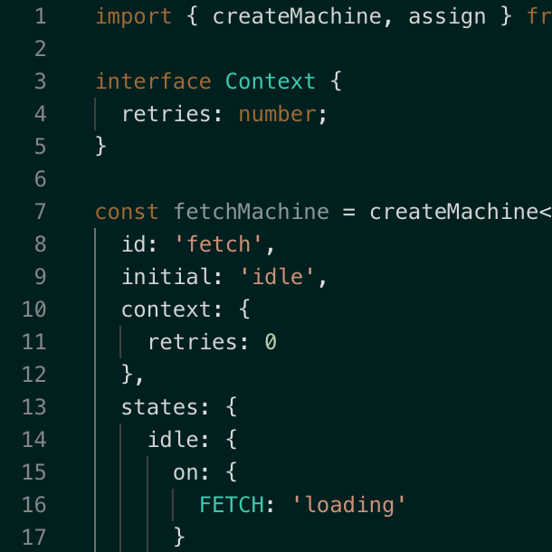<strong>Garden of Atlantis</strong></li>
  <li>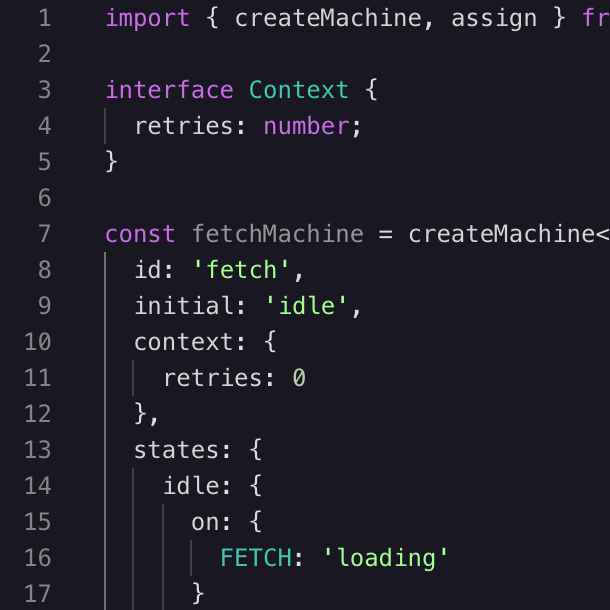<strong>Martian Night</strong></li>
  <li>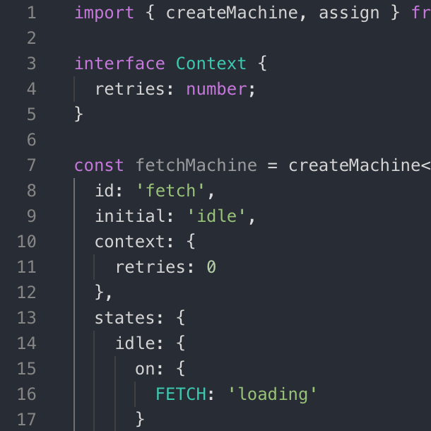<strong>Atom One Dark</strong></li>
</ul>

### 如何更改代码编辑器的颜色主题

1. 使用顶部菜单栏中的按钮进入 Setting。
2. 向下滚动到 **Editor Theme** 部分。
3. 从下拉菜单中选择你喜欢的主题。
4. 使用顶部菜单栏中的 **Code** 按钮返回代码视图。

## 视图控件

  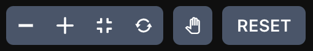

视图控制面板可帮助你浏览状态图。

<iframe src="https://www.loom.com/embed/806824c22a97421694f0aa45a74b91e8" frameborder="0" webkitallowfullscreen mozallowfullscreen allowfullscreen style="position: absolute; top: 0; left: 0; width: 100%; height: 100%;"></iframe>

<ul class="icon-list">
  <li><strong>Zoom out</strong>. 缩小画布以看到更多状态图信息。</li>
  <li><strong>Zoom in</strong>. 放大画布以看清更多状态图细节。</li>
  <li><strong>Fit to view</strong>. 将状态图缩放至适合可视区域的大小。</li>
  <li><strong>Reset canvas</strong>. 将状态图重置至 100% 缩放级别，并将其放在可视区域的左上角。</li>
  <li><strong>Hand tool</strong>. 点击后进入拖拽模式。按住并拖动以便其在画布上移动。取消选中即可退出拖拽模式。</li>
  <li><strong>Reset button</strong>. 将状态图重置为其初始状态。</li>
</ul>

## 键盘快捷键和命令面板

你可以使用快捷键调用常用的可视化命令。指令列表在 Settings 的 **Keyboard shortcuts**。

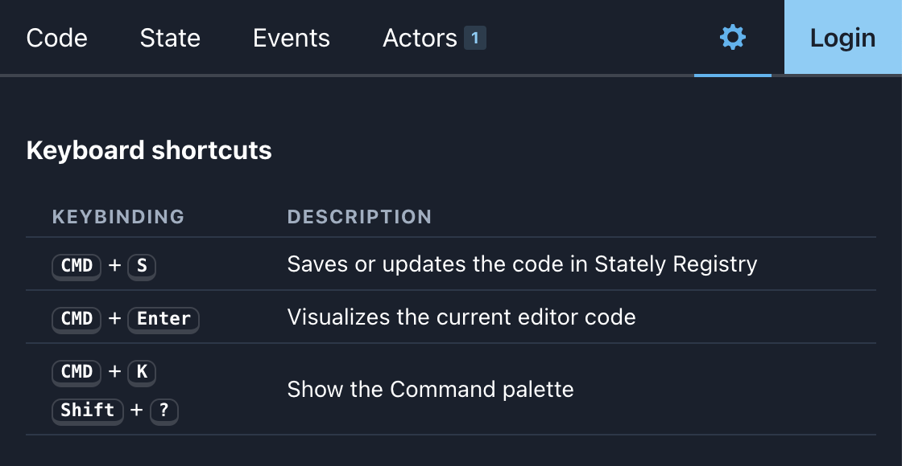

<iframe src="https://www.loom.com/embed/fedfec4a3ad5471d9f72a4c611ea9ee8" frameborder="0" webkitallowfullscreen mozallowfullscreen allowfullscreen style="position: absolute; top: 0; left: 0; width: 100%; height: 100%;"></iframe>

- <kbd>CMD</kbd> + <kbd>S</kbd> 在 [Stately Registry](https://stately.ai/registry) 中保存或更新代码。
- <kbd>CMD</kbd> + <kbd>Enter</kbd> 可视化当前编辑的代码。
- <kbd>CMD</kbd> + <kbd>K</kbd> 显示命令面板。
- <kbd>Shift</kbd> + <kbd>?</kbd> 显示命令面板。

### 命令面板

使用 <kbd>CMD</kbd> + <kbd>K</kbd> 或 <kbd>Shift</kbd> + <kbd>?</kbd> 快捷键调出 **command palette**。你可以在控制面板中找到常用的可视化命令。

命令面板将来会有更多命令。

## 更多

- 使用 GitHub 登录
- 本地自动保存

## 即将推出的功能

我们即将推出更多功能。包含：

- 支持 Lucy DSL（领域特定语言）
- 自定义事件和事件负载支持

## 参与其中

[带我去 Visualizer!](https://stately.ai)

[尝试在 Inspect 模式下 Visualizer](https://stately.ai/viz?inspect)

Visualizer 现在可用，并且将永远免费和开源。欢迎投稿！

### 反馈和错误报告

如果你有任何反馈或有任何功能要求，请 [加入我们的 Discord server](https://discord.gg/xstate) 在这里你可以找到我们的团队和精彩的 XState 社区。

请 [提交任何错误信息在 GitHub XState 仓库的 issues 中](https://github.com/statelyai/xstate/issues)。
