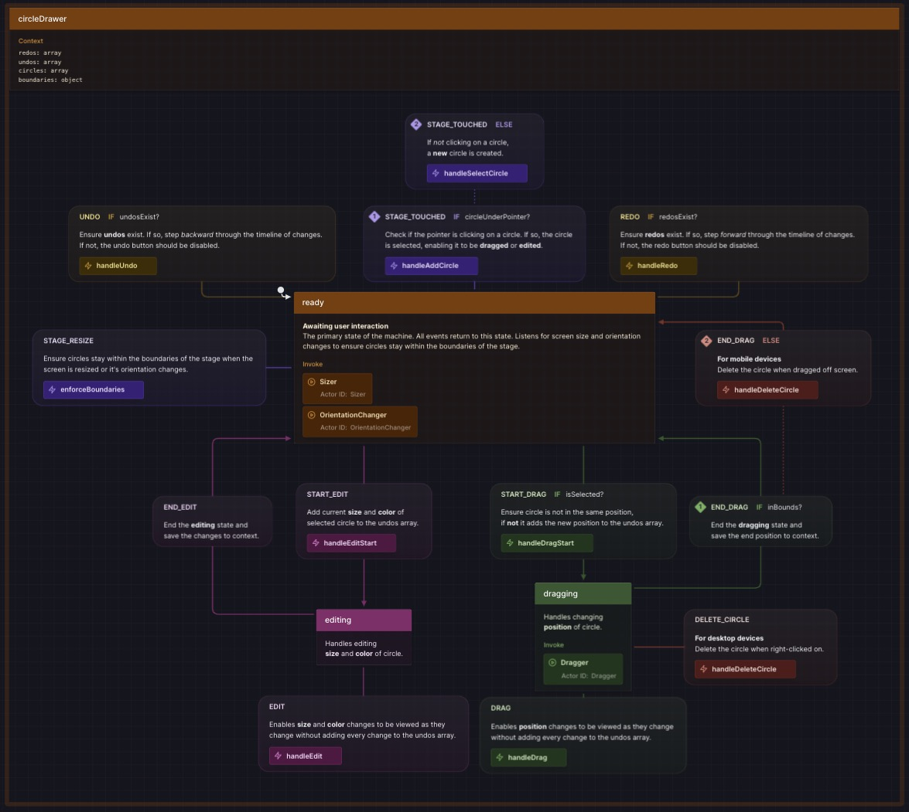

# XState v5 + React - 7GUIs Circle Drawer

This is an example of using XState v5 with React. It's based loosely on the 7GUIs Circle Drawer task.

Built with:

- Stately Studio
- XState 5
- React 18
- Typescript
- Vite

## The 7GUIs Project

The 7GUIs project is a programming benchmark to compare implementations in terms of their notation. 7GUIs defines seven tasks that represent typical challenges in GUI programming. The Circle Drawer project is the sixth of the seven challenges.

Circle Drawer’s goal is, among other things, to test how well the challenge of implementing undo/redo functionality for a GUI application can be solved. Moreover, Circle Drawer tests how dialog control, i.e. keeping the relevant context between several successive GUI interaction steps, is achieved in the source code. Lastly, the ease of custom drawing is tested. The task is to implement a simple drawing application with the following features:

### Criteria:

- Build a frame containing an undo and redo button as well as a canvas area underneath.
- Left-clicking inside an empty area inside the canvas will create an unfilled circle with a fixed diameter whose center is the left-clicked point.
- The circle nearest to the mouse pointer such that the distance from its center to the pointer is less than its radius, if it exists, is filled with the color gray.
- The gray circle is the selected circle.
- Right-clicking a selected circle will make a popup menu appear with one entry “Adjust diameter..”.
- Clicking on this entry will open another frame with a slider inside that adjusts the diameter of selected circle (changes are applied immediately).
- Closing this frame will mark the last diameter as significant for the undo/redo history.
- Clicking undo will undo the last significant change (i.e. circle creation or diameter adjustment).
- Clicking redo will reapply the last undone change unless new changes were made by the user in the meantime.

Visit the [7GUIs project](https://eugenkiss.github.io/7guis/tasks#circle "Circle Drawer") for more info.

Original GUI: Panel obstructs view of item being edited.

## This Version

The original GUI for this project is pretty outdated. Accessing the diameter control required a number of unnecessary steps as described in this excerpt from the 7GUIs project page:

> 1. Right-clicking a selected circle will make a popup menu appear with one entry “Adjust diameter..”.
> 2. Clicking on this entry will open another frame with a slider inside that adjusts the diameter of selected circle.
> 3. Closing this frame will mark the last diameter as significant for the undo/redo history.

This version has been modified for easier editing of the circles. Much of the original criteria has been kept and more features have been added. The controls are at the top of the page and can be accessed without having to open panels. The functionality has been extended to allow for dragging circles to new positions, changing their color, and deleting them. This version is responsive and can be used on any device. The original GUI had a fixed width and height which didn't adapt to different environments or recognize touch events. Below is a screenshot of the updated GUI.

### CSS, Canvas, or SVG?

This version uses CSS instead of canvas for drawing the circles. Partly because it's easier to test. Also, most developers are more familiar with CSS than canvas, and this is primarily a demonstration of using XState. Canvas is designed for complex graphics used in gaming and heavy bitmap manipulation, like animation. In this project, the circles are not being animated heavily, so CSS is more than sufficient for the task.

SVG is another option for creating web graphics. It's what I started this project with but there is no way to change the layer order of SVG elements, which causes bugs when attempting to select circles that overlap. CSS has a `z-index` property that controls the stacking order of DOM elements. With the `z-index` property and a bit of JavaScript, that problem is easily solved.

### State Machine\*

This state machine, called "Circle Drawer," is a tool that allows users to draw and manipulate circles on a screen. It keeps track of the circles' size, color, and position. Here's a summary of how it works:

1. **Ready state**: This is the initial state where the machine waits for user interaction. From here, the user can perform various actions:
   - Edit a circle's **size** or **color**.
   - Drag a circle to change its **position**.
   - **Undo** the previous action if there is one.
   - **Redo** an action that was undone.
   - **Add** a new circle or **select** an existing one by clicking on it.
2. **Editing state**: When the user starts editing a circle, the machine enters this state. Here, the user can make changes to the size and color of the selected circle. The changes are immediately visible without being added to the undo history. When editing is finished, the changes are saved.
3. **Dragging state**: When the user starts dragging a circle, the machine enters this state. Here, the user can change the position of the selected circle by dragging it. The changes are immediately visible without being added to the undo history. The user can end the dragging state which saves the final position of the circle. If the circle is dragged off the screen, it will be deleted. Throughout the process, the machine keeps track of the user's actions, allowing them to undo and redo previous changes. It also ensures that the circles stay within the bounds of the screen.

**Note**: The undo/redo functionality is implemented using a stack data structure. Each time the user makes a change, it is pushed onto the undo stack. When the user undoes an action, the change is popped off the undo stack and pushed onto the redo stack. If the user redoes an action, the change is popped off the redo stack and pushed back onto the undo stack.

You can find the source code for this state machine on GitHub: [Circle Drawer State Machine (code)](https://github.com/stevebarakat/circle-drawer/blob/main/src/machine.ts)

_\* Description generated by [Stately.ai](https://stately.ai/registry/editor/35199c04-6caf-4633-a21d-2550be97dcc9?machineId=84088955-1f67-4d91-af89-425c5e55324e "Circle Drawer")_.

    <a href="https://stately.ai/registry/editor/35199c04-6caf-4633-a21d-2550be97dcc9?machineId=84088955-1f67-4d91-af89-425c5e55324e">Circle Drawer State Machine</a>

