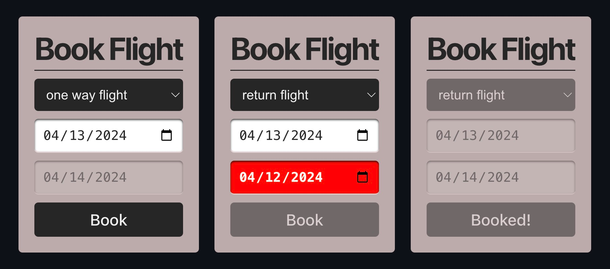

# 7guis-flight-booker-react

## What it teaches

Guarded transitions plus an invoked async actor: nested states model one-way vs. return trips, guards reject invalid date ranges, and booking runs as an invoked actor with `onDone`/`onError`. This is [the 7GUIs flight booker task](https://eugenkiss.github.io/7guis/tasks#flight).

## XState features used

- `setup()` with `schemas`, named `guards`, and `actors`
- Nested states and transition functions returning `{ target }` / `{ context }`
- `createAsyncLogic` invoked with `onDone` and `onError`
- `createActorContext` from `@xstate/react` (`Provider`, `useActorRef`, `useSelector`)

## Run it

```bash
pnpm install
pnpm dev
```

## Inspect it

This example does not bundle an inspector. To watch the actor live, add [`@statelyai/sdk`](https://stately.ai/docs/inspector) and pass it to the hook:

```ts
import { createInspector } from '@statelyai/sdk';

const inspector = createInspector();

const [state, send] = useActor(flightBookerMachine, {
  inspect: inspector.inspect
});
```

The same `inspect` option can be passed to `FlightContext.Provider` via its `options` prop. Then open https://stately.ai/registry/inspect.

## Notes

Built against the XState v6 alpha in this repo (`xstate: workspace:*`), not a published release.

Global helper types (`FlightData`, `Input`, `EventType`, …) live in `types.d.ts` at the package root rather than being imported per file.

## Screenshots



[](https://stackblitz.com/github/statelyai/xstate/tree/main/examples/7guis-flight-booker-react)
