# CameoParison example - Actors

[Open in CodeSandbox](https://codesandbox.io/embed/github/statelyai/xstate/tree/main/examples/cameoparison-svelte-actors)

This is an XState port of [Rich-Harris/cameoparison-starter](https://github.com/Rich-Harris/cameoparison-starter).
You can check out the [course on Frontend Masters](https://frontendmasters.com/courses/svelte/building-an-application-frame/).

## Recommended IDE Setup

[VSCode](https://code.visualstudio.com/) + [Svelte](https://marketplace.visualstudio.com/items?itemName=svelte.svelte-vscode).

## Run this example locally

1. `pnpm install`
2. `pnpm run dev`
3. Open http://localhost:3000

## Actor-model

