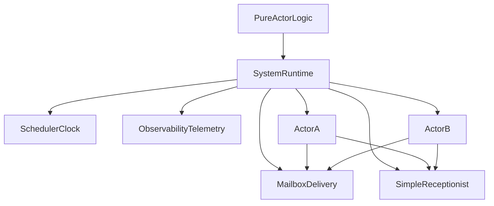

# XState System Plan (vNext)

This document consolidates and supersedes `xstate-system-vnext_2966efc1.plan.md` so all planning is in one place.

Key constraint for this plan: the pure `System` contract/interface belongs to XState core (`packages/core`), not a separate `@xstate/system-core` package.

## Design Goal

Create an explicit `System` runtime boundary that:

- keeps actor logic pure/portable (`transition(state, event) -> nextState + effects`)
- provides shared runtime services (clock/scheduler, logger, delivery, telemetry)
- enables provider-specific runtime adapters (AWS, Cloudflare, Vercel, etc.) without changing machine logic
- keeps receptionist semantics simple for phase 1: `register(...)` + `get(...)` single-key behavior

## Common-Denominator Mapping

- **Traditional actor model:** system = address space + delivery semantics + scheduling boundary
- **Akka:** explicit runtime container (`ActorSystem`) with scheduler, dispatch, guardians, discovery
- **Orleans:** explicit runtime boundary (silo/cluster) with identity/directory and activation lifecycle

Adopt this denominator for XState: **System is infrastructure/runtime, not an actor**.

## Recommended Core Model

### 1) Explicit `System` object in core

Introduce/shape `createSystem(config)` as the primary runtime boundary in `packages/core`.

A `System` owns:

- receptionist lookup (phase-1 simple semantics)
- default logger
- default clock/scheduler
- message delivery policy (mailbox + routing guarantees)
- observability hooks (inspect + OTEL bridge surface)

Root actors are spawned _in_ a system; the system itself is not a normal actor.

### 2) Canonical actor creation API

Prefer **`sys.createActor(logic, options)`** as canonical.

Why this is better than `machine.createActor({ system })`:

- makes runtime boundary explicit at callsite
- scales to multi-root systems naturally (a single `System` can host multiple independent root actors/actor trees that share system services)
- mirrors prior art (`ActorSystem` as host)
- cleaner for non-machine logic creators (`fromPromise`, `fromObservable`, etc.)

Keep ergonomic compatibility:

- `createActor(logic, options)` remains valid and can use an implicit default system
- standardize on `createActor(machine)` for implicit-system usage; remove `machine.createActor(...)` sugar

### 3) Simple receptionist (reflecting current runtime)

Keep receptionist behavior intentionally close to current runtime:

- one registered actor per key (same collision/error behavior)
- operations:
  - `register(key, ref)` (maps to today’s `_set(systemId, ref)`)
  - `get(key)` (maps to today’s `get(systemId)`)
  - optional `getAll()` passthrough for diagnostics/tests
- strongly typed keys remain via `ActorSystem<T['actors']>` generic mapping

Do **not** introduce multi-registration/listings/subscriptions in this phase.

### 4) Clear lifecycle invariants

Define strict system invariants:

- actor discoverability rules are explicit and test-backed
- actor deregisters atomically on stop/error/parent stop
- parent stop recursively removes descendant registrations
- no stale refs returned by lookup after stop completion

### 5) Delivery/mailbox contract (portable semantics)

Expose delivery semantics at system level:

- default guarantee: per-sender FIFO to a target mailbox (in-process)
- delayed delivery routed via system scheduler
- dropped-message behavior is observable (dev warning + telemetry counter)
- optional pluggable mailbox strategy (bounded/unbounded/coalescing)

### 6) Observability as first-class runtime service

Unify inspection and telemetry:

- lifecycle events: actor started/stopped/restarted/errored
- message events: enqueued/dequeued/delivered/dropped
- scheduler events: scheduled/canceled/fired
- registry events: registered/deregistered/lookup-changed
- optional OTEL adapter converts runtime events into spans/metrics

## Provider Adapter Strategy

Provider packages implement the core `System` contract and pass shared conformance tests:

- `@xstate/system-inmemory` (reference implementation)
- `@xstate/system-aws`
- `@xstate/system-cloudflare`
- `@xstate/system-vercel`

Optional capabilities (non-required for core compliance):

- durability (checkpoint/restore, durable schedule)
- coordination (lease/ownership)
- idempotency store
- partition/shard routing

Core runtime semantics must still hold when these capabilities are absent.

## Proposed API Shape (Conceptual)

```ts
const sys = createSystem({
  clock,
  logger,
  scheduler,
  observability: { adapter: otelAdapter }
});

const root = sys.createActor(appMachine, { id: 'root' });
root.start();

sys.receptionist.register('worker', someWorker);
const worker = sys.receptionist.get('worker');
```

## Compatibility & Migration Strategy

- preserve `systemId` + `system.get(...)` semantics in phase 1
- introduce explicit system creation syntax (`createSystem` + `sys.createActor`) while preserving receptionist behavior
- standardize examples/docs on `createActor(machine)` and `sys.createActor(machine, ...)`
- rewrite tests to new syntax/API shape without changing receptionist behavior assertions
- defer deprecations/codemods until receptionist v2 is designed
- treat future capabilities as additive-only (feature detection/capabilities object), so phase-1 consumers do not break
- freeze a minimal stable `System` contract first; add new runtime features via optional extension points

## What You Might Be Missing (Checklist)

- addressing model split (later): service discovery vs instance identity
- supervision semantics at system boundary (restart/stop/escalate)
- deterministic mode (seeded IDs + replayable event traces)
- backpressure/resource limits and queue-depth observability
- security/capability boundaries for discovery and send access
- provider-level guarantees documentation (at-least-once, retries, scheduling drift)
- versioned capability negotiation (`system.capabilities`) so adapters can evolve without breaking API consumers

## Implementation Checklist (PR-Sized)

### PR1: Core Contract + Public API Shape

- [ ] Define/adjust `System` interface in `packages/core/src/system.ts`
- [ ] Export `createSystem` from `packages/core/src/index.ts`
- [ ] Keep receptionist methods mapped to current semantics (`register/get/getAll`)
- [ ] Update `packages/core/src/types.ts` with public-facing system types
- [ ] Add/refresh doc comments for runtime guarantees

### PR2: Actor Wiring + Canonical Entry

- [ ] Add/confirm `sys.createActor(...)` as canonical path
- [ ] Keep `createActor(...)` implicit-system compatibility
- [ ] Remove `machine.createActor(...)` usage and support from public API/docs
- [ ] Ensure root/child lifecycle behavior remains unchanged
- [ ] Validate `systemId` registration/unregistration behavior parity

### PR3: Tests Rewritten to New Syntax/API

- [ ] Rewrite `packages/core/test/system.test.ts` to exercise new API shape
- [ ] Rewrite `packages/core/test/spawn.test.ts` where relevant
- [ ] Preserve existing behavior assertions (collisions, cleanup, lookup availability)
- [ ] Keep skipped edge-case tests tracked (nested deregistration cleanup)

### PR4: Observability Contract Surface

- [ ] Define lifecycle/message/scheduler/registry event envelope
- [ ] Add extension point for OTEL adapters
- [ ] Ensure inspection still works with new system creation syntax
- [ ] Add focused tests for emitted runtime events

### PR5: In-Memory Adapter + Conformance Harness

- [ ] Add `@xstate/system-inmemory` as reference adapter
- [ ] Create shared conformance tests (in monorepo) for adapter compliance
- [ ] Validate receptionist, delivery, scheduler, lifecycle semantics
- [ ] Document adapter authoring guide

### PR6: Cloudflare Adapter Pilot

- [ ] Scaffold `@xstate/system-cloudflare`
- [ ] Mark optional capabilities + guarantees matrix
- [ ] Run conformance suite against Cloudflare baseline
- [ ] Add a small end-to-end sample for Cloudflare runtime usage

### PR7 (Next Phase): Additional Cloud Adapters

- [ ] Scaffold `@xstate/system-aws`
- [ ] Scaffold `@xstate/system-vercel`
- [ ] Run conformance suite against each new adapter baseline

## Test Strategy

- Update existing tests to use canonical system creation syntax where relevant
- Preserve current receptionist behavior checks and edge cases
- Add conformance tests for:
  - registration/lookup lifecycle
  - delivery ordering
  - scheduler/cancel semantics
  - lifecycle event emission
  - stop/error cleanup behavior

## Candidate Code Touchpoints

- `packages/core/src/system.ts`
- `packages/core/src/createActor.ts`
- `packages/core/src/types.ts`
- `packages/core/src/index.ts`
- `packages/core/test/system.test.ts`
- `packages/core/test/spawn.test.ts`

## Risks and Mitigations

- **Risk:** API churn without semantic clarity.
  - **Mitigation:** lock runtime invariants before broad adapter work.
- **Risk:** provider adapters drift behaviorally.
  - **Mitigation:** conformance test suite in monorepo.
- **Risk:** hidden lifecycle regressions around registration/unregistration.
  - **Mitigation:** explicit lifecycle tests including nested actor stop paths.

## High-Level Architecture



## Open Follow-Ups (Post Phase 1)

- richer receptionist primitives (typed service keys, multi-registration, listing subscriptions)
- stronger durability-first profile for long-running workflow runtimes
- explicit deprecation timeline for old APIs once new system syntax stabilizes
- expand provider adapters beyond Cloudflare after pilot confidence
